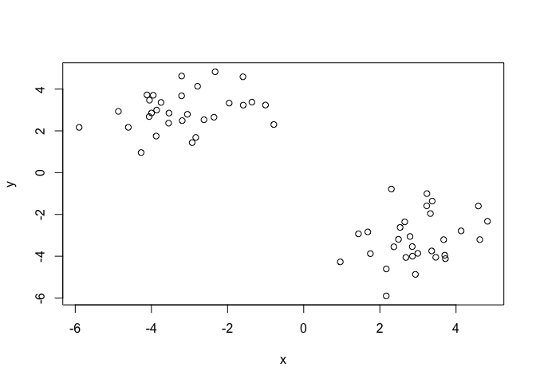
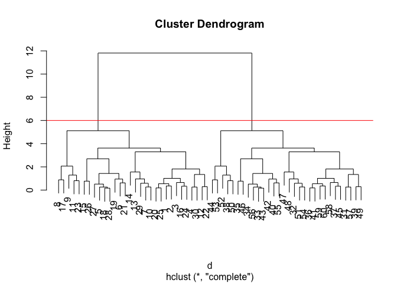
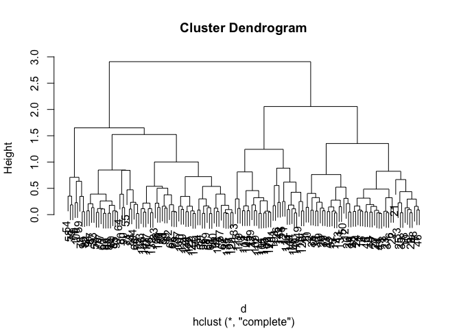
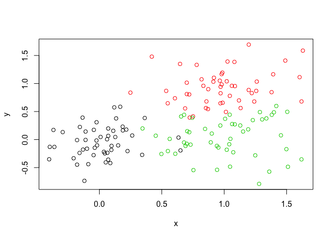
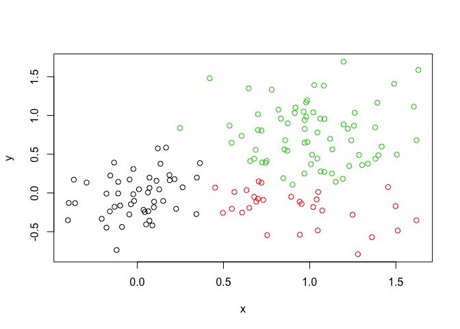
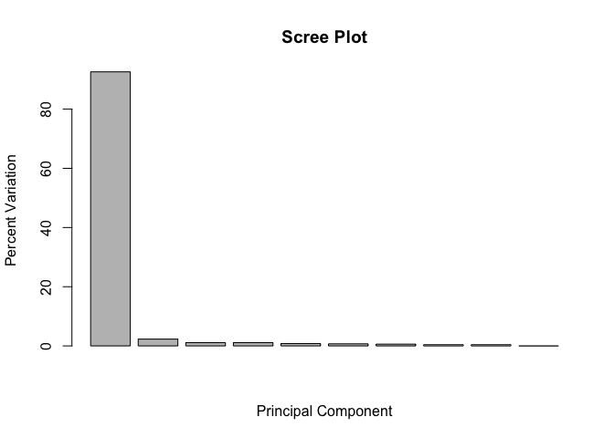
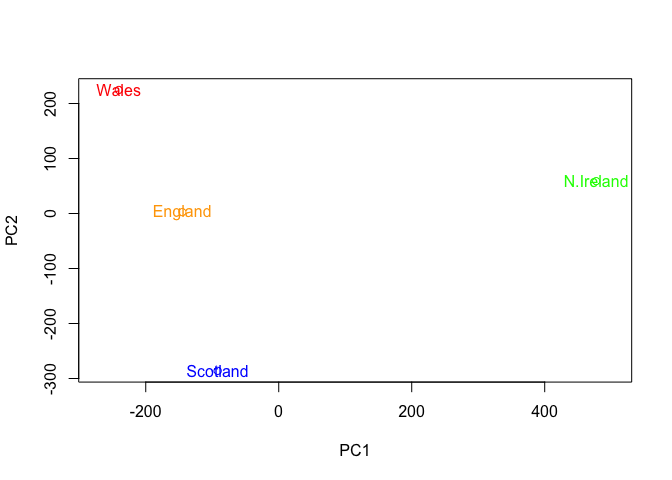
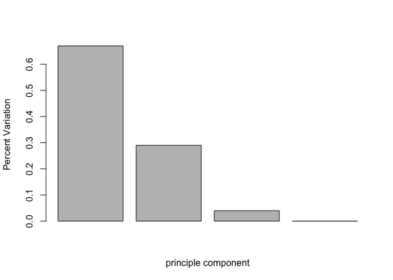

Class8: Introduction to machine learning for Bioinformatics
================
Xuerui Huang
4/26/2019

# Introduction to machine learning

generate a set of random data to perform simple machine learning

``` r
# Generate some example data for clustering
tmp <- c(rnorm(30,-3), rnorm(30,3))
x <- cbind(x=tmp, y=rev(tmp))

# plot the odata
plot(x)
```

<!-- -->

## K means clustering

Using the randomly generated data to perform K means clustering

``` r
#perform kmeans
kmeans_res <- kmeans(x,2,20)

kmeans_res #print result
```

    ## K-means clustering with 2 clusters of sizes 30, 30
    ## 
    ## Cluster means:
    ##           x         y
    ## 1 -3.172981  2.962985
    ## 2  2.962985 -3.172981
    ## 
    ## Clustering vector:
    ##  [1] 1 1 1 1 1 1 1 1 1 1 1 1 1 1 1 1 1 1 1 1 1 1 1 1 1 1 1 1 1 1 2 2 2 2 2
    ## [36] 2 2 2 2 2 2 2 2 2 2 2 2 2 2 2 2 2 2 2 2 2 2 2 2 2
    ## 
    ## Within cluster sum of squares by cluster:
    ## [1] 65.93221 65.93221
    ##  (between_SS / total_SS =  89.5 %)
    ## 
    ## Available components:
    ## 
    ## [1] "cluster"      "centers"      "totss"        "withinss"    
    ## [5] "tot.withinss" "betweenss"    "size"         "iter"        
    ## [9] "ifault"

``` r
kmeans_res$centers #print the cluster center
```

    ##           x         y
    ## 1 -3.172981  2.962985
    ## 2  2.962985 -3.172981

``` r
#plot kmeans
plot(x,col = kmeans_res$cluster)+points(kmeans_res$centers,col = "blue",pch = 18,cex = 3)
```

<!-- -->

    ## integer(0)

Q. How many points are in each cluster? 30

Q. What ‘component’ of your result object details - cluster size? -
cluster assignment/membership? - cluster center?

## Hierrachical Clustering

Using the randomly generated data to perform Hierrachical Clustering

``` r
# perform Hierrachical Clustering
d <- dist(x) #calculate the distance
hc <- hclust(d) #Hierrachical Clustering
hc # print the result
```

    ## 
    ## Call:
    ## hclust(d = d)
    ## 
    ## Cluster method   : complete 
    ## Distance         : euclidean 
    ## Number of objects: 60

``` r
# plot the result and cut the tree at height of 6
plot(hc)+abline(h = 6,col = "red")
```

<!-- -->

    ## integer(0)

``` r
cutree(hc,h = 6)
```

    ##  [1] 1 1 1 1 1 1 1 1 1 1 1 1 1 1 1 1 1 1 1 1 1 1 1 1 1 1 1 1 1 1 2 2 2 2 2
    ## [36] 2 2 2 2 2 2 2 2 2 2 2 2 2 2 2 2 2 2 2 2 2 2 2 2 2

Now, generate another set of data

``` r
# data generation
x <- rbind(
  matrix(rnorm(100, mean=0, sd = 0.3), ncol = 2),   # c1
  matrix(rnorm(100, mean = 1, sd = 0.3), ncol = 2), # c2
  matrix(c(rnorm(50, mean = 1, sd = 0.3),           # c3
           rnorm(50, mean = 0, sd = 0.3)), ncol = 2))
colnames(x) <- c("x", "y")

# plot the data
plot(x)
```

<!-- -->

Perform Hierrachical Clustering and plot in different ways

``` r
# Step 3. Generate colors for known clusters
#         (just so we can compare to hclust results)
col <- as.factor( rep(c("c1","c2","c3"), each=50) )
plot(x, col=col)
```

<!-- -->

``` r
# perform clustering
d <- dist(x)
hc <- hclust(d)
hc 
```

    ## 
    ## Call:
    ## hclust(d = d)
    ## 
    ## Cluster method   : complete 
    ## Distance         : euclidean 
    ## Number of objects: 150

``` r
plot(hc)
```

<!-- -->

``` r
#original clustering
plot(x, col=col)
```

<!-- -->

``` r
#two groups
plot(x, col=cutree(hc,k = 2))
```

<!-- -->

``` r
#three groups
plot(x, col=cutree(hc,k =3))
```

<!-- -->

# Introduction to PCA

## Gene data PCA

load the gene data and do PCA

``` r
mydata <- read.csv("https://tinyurl.com/expression-CSV",row.names=1)
head(mydata)
```

    ##        wt1 wt2  wt3  wt4 wt5 ko1 ko2 ko3 ko4 ko5
    ## gene1  439 458  408  429 420  90  88  86  90  93
    ## gene2  219 200  204  210 187 427 423 434 433 426
    ## gene3 1006 989 1030 1017 973 252 237 238 226 210
    ## gene4  783 792  829  856 760 849 856 835 885 894
    ## gene5  181 249  204  244 225 277 305 272 270 279
    ## gene6  460 502  491  491 493 612 594 577 618 638

Thre are 100 genes in this dataset

``` r
pca <- prcomp(t(mydata),scale = TRUE)
summary(pca)
```

    ## Importance of components:
    ##                           PC1    PC2     PC3     PC4     PC5     PC6
    ## Standard deviation     9.6237 1.5198 1.05787 1.05203 0.88062 0.82545
    ## Proportion of Variance 0.9262 0.0231 0.01119 0.01107 0.00775 0.00681
    ## Cumulative Proportion  0.9262 0.9493 0.96045 0.97152 0.97928 0.98609
    ##                            PC7     PC8     PC9      PC10
    ## Standard deviation     0.80111 0.62065 0.60342 3.348e-15
    ## Proportion of Variance 0.00642 0.00385 0.00364 0.000e+00
    ## Cumulative Proportion  0.99251 0.99636 1.00000 1.000e+00

``` r
attributes(pca)
```

    ## $names
    ## [1] "sdev"     "rotation" "center"   "scale"    "x"       
    ## 
    ## $class
    ## [1] "prcomp"

``` r
#plot the first two pca components
plot(pca$x[,1],pca$x[,2])
```

<!-- -->

``` r
#well seperated

# Perfect variation is oftern more informative to look at
pca.var <- pca$sdev^2
pca.var.per <- round (pca.var/sum(pca.var)*100,1)

# add variaion percentage to tyhe plot
pca.var.per
```

    ##  [1] 92.6  2.3  1.1  1.1  0.8  0.7  0.6  0.4  0.4  0.0

``` r
xlab <- paste("PC1 (",pca.var.per[1],"%)",sep = "")
ylab <- paste("PC2 (",pca.var.per[2],"%)",sep = "")
sample.type <- substr(colnames(mydata),1,2)

plot(pca$x[,1],pca$x[,2],col=as.factor(sample.type),xlab = xlab, ylab = ylab)
```

<!-- -->

``` r
# plot barplot
barplot(pca.var.per, main="Scree Plot", 
        xlab="Principal Component", ylab="Percent Variation")
```

<!-- -->

## Food Data PCA

load food data from BGGN213 homepage

``` r
#load data
require(dplyr)
```

    ## Loading required package: dplyr

    ## 
    ## Attaching package: 'dplyr'

    ## The following objects are masked from 'package:stats':
    ## 
    ##     filter, lag

    ## The following objects are masked from 'package:base':
    ## 
    ##     intersect, setdiff, setequal, union

``` r
x <- read.csv("https://bioboot.github.io/bggn213_f17/class-material/UK_foods.csv")
dim(x)
```

    ## [1] 17  5

``` r
head(x)
```

    ##                X England Wales Scotland N.Ireland
    ## 1         Cheese     105   103      103        66
    ## 2  Carcass_meat      245   227      242       267
    ## 3    Other_meat      685   803      750       586
    ## 4           Fish     147   160      122        93
    ## 5 Fats_and_oils      193   235      184       209
    ## 6         Sugars     156   175      147       139

``` r
require(tibble)
```

    ## Loading required package: tibble

``` r
x <- read.csv("https://bioboot.github.io/bggn213_f17/class-material/UK_foods.csv") %>% 
  column_to_rownames(., var = "X") %>% t(.) 

x <- read.csv("https://bioboot.github.io/bggn213_f17/class-material/UK_foods.csv",
              row.names = 1)
```

plot the original data to get a brief view

``` r
###########plot data
#beside
barplot(as.matrix(x), beside=T, col=rainbow(nrow(x)))
```

<!-- -->

``` r
#stacked
barplot(as.matrix(x), beside=F, col=rainbow(nrow(x)))
```

<!-- -->

``` r
pairs(x, col=rainbow(10), pch=16)
```

<!-- -->

Perform PCA

``` r
############ PCA
pca <- prcomp(t(x))
pca_res <- summary(pca)
```

Plot PC1 vs PC2 and color different region with different color

``` r
col_vec <- c("orange","red","blue","green")
plot(pca$x[,1], pca$x[,2], xlab="PC1", ylab="PC2", xlim=c(-270,500),col = col_vec)+
  text(pca$x[,1], pca$x[,2], colnames(x),col = col_vec)
```

<!-- -->

    ## integer(0)

Plot the barplot of the variances (eigenvalues) with respect to the
principal component number

``` r
#calculate the proportion
v <- round( pca$sdev^2/sum(pca$sdev^2),2)
v
```

    ## [1] 0.67 0.29 0.04 0.00

``` r
# plot the barplot of percentage variancce
pca_res$importance
```

    ##                              PC1       PC2      PC3          PC4
    ## Standard deviation     324.15019 212.74780 73.87622 4.188568e-14
    ## Proportion of Variance   0.67444   0.29052  0.03503 0.000000e+00
    ## Cumulative Proportion    0.67444   0.96497  1.00000 1.000000e+00

``` r
barplot(v,xlab = "principle component",ylab="Percent Variation")
```

<!-- -->

``` r
# Focus on PC1 as it accounts for > 90% of variance 
par(mar=c(10, 3, 0.35, 0))
barplot( pca$rotation[,1], las=2 )
```

<!-- -->

Try the Biplots

``` r
biplot(pca)
```

<!-- -->
