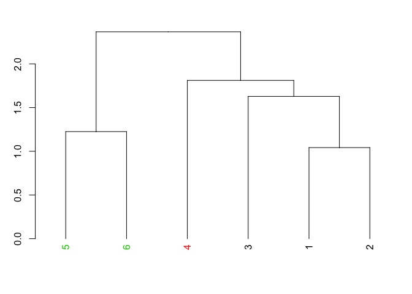
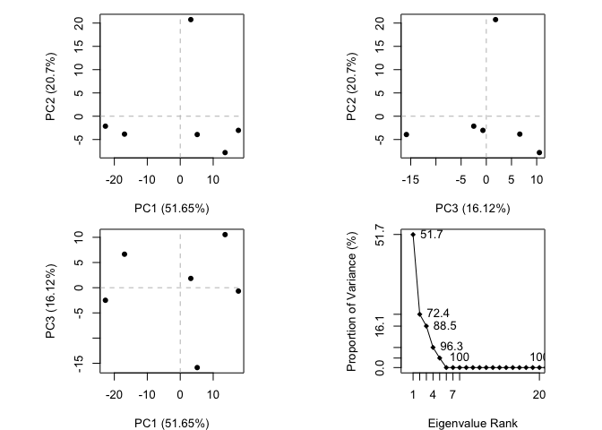

Class 11: Structural Bioinformatics (Part 1)
================
Xuerui Huang
5/8/2019

# Load PDB Data Export Summary

``` r
#load data
db <- read.csv("Data Export Summary.csv")
#read(db)

#total number of protein structure
sum(db$Total)
```

    ## [1] 151754

``` r
#percent of protein
db$Perc <- (db$Total/sum(db$Total))*100
```

# Section 3 Introduction to Bio3D in R

Bio3D is an R package for structural bioinformatics , . Features include
the ability to read, write 1 2 3 and analyze biomolecular structure,
sequence and dynamic trajectory data.

``` r
library(bio3d)
```

load 1hsg data from PDB

``` r
pdb <- read.pdb("1hsg.pdb")

aa321(pdb$seqres) #show protein sequence
```

    ##   [1] "P" "Q" "I" "T" "L" "W" "Q" "R" "P" "L" "V" "T" "I" "K" "I" "G" "G"
    ##  [18] "Q" "L" "K" "E" "A" "L" "L" "D" "T" "G" "A" "D" "D" "T" "V" "L" "E"
    ##  [35] "E" "M" "S" "L" "P" "G" "R" "W" "K" "P" "K" "M" "I" "G" "G" "I" "G"
    ##  [52] "G" "F" "I" "K" "V" "R" "Q" "Y" "D" "Q" "I" "L" "I" "E" "I" "C" "G"
    ##  [69] "H" "K" "A" "I" "G" "T" "V" "L" "V" "G" "P" "T" "P" "V" "N" "I" "I"
    ##  [86] "G" "R" "N" "L" "L" "T" "Q" "I" "G" "C" "T" "L" "N" "F" "P" "Q" "I"
    ## [103] "T" "L" "W" "Q" "R" "P" "L" "V" "T" "I" "K" "I" "G" "G" "Q" "L" "K"
    ## [120] "E" "A" "L" "L" "D" "T" "G" "A" "D" "D" "T" "V" "L" "E" "E" "M" "S"
    ## [137] "L" "P" "G" "R" "W" "K" "P" "K" "M" "I" "G" "G" "I" "G" "G" "F" "I"
    ## [154] "K" "V" "R" "Q" "Y" "D" "Q" "I" "L" "I" "E" "I" "C" "G" "H" "K" "A"
    ## [171] "I" "G" "T" "V" "L" "V" "G" "P" "T" "P" "V" "N" "I" "I" "G" "R" "N"
    ## [188] "L" "L" "T" "Q" "I" "G" "C" "T" "L" "N" "F"

``` r
# Print a subset of $atom data for the first two atoms
pdb$atom[1:2, c("eleno", "elety", "x","y","z")]
```

    ##   eleno elety      x      y     z
    ## 1     1     N 29.361 39.686 5.862
    ## 2     2    CA 30.307 38.663 5.319

``` r
# Print a summary of the coordinate data in $xyz
pdb$xyz
```

    ## 
    ##    Total Frames#: 1
    ##    Total XYZs#:   5058,  (Atoms#:  1686)
    ## 
    ##     [1]  29.361  39.686  5.862  <...>  30.112  17.912  -4.791  [5058] 
    ## 
    ## + attr: Matrix DIM = 1 x 5058

``` r
# Examine the row and column dimensions
dim(pdb$xyz)
```

    ## [1]    1 5058

``` r
# Print coordinates for the first two atom
pdb$xyz[ 1, atom2xyz(1:2) ]
```

    ## [1] 29.361 39.686  5.862 30.307 38.663  5.319

# Section 4: Atom selection

``` r
# Select all C-alpha atoms 
ca.inds <- atom.select(pdb, "calpha")
ca.inds
```

    ## 
    ##  Call:  atom.select.pdb(pdb = pdb, string = "calpha")
    ## 
    ##    Atom Indices#: 198  ($atom)
    ##    XYZ  Indices#: 594  ($xyz)
    ## 
    ## + attr: atom, xyz, call

``` r
# print info
head( pdb$atom[ca.inds$atom, ] )
```

    ##    type eleno elety  alt resid chain resno insert      x      y     z o
    ## 2  ATOM     2    CA <NA>   PRO     A     1   <NA> 30.307 38.663 5.319 1
    ## 9  ATOM     9    CA <NA>   GLN     A     2   <NA> 30.158 36.492 2.199 1
    ## 18 ATOM    18    CA <NA>   ILE     A     3   <NA> 29.123 33.098 3.397 1
    ## 26 ATOM    26    CA <NA>   THR     A     4   <NA> 29.774 30.143 1.062 1
    ## 33 ATOM    33    CA <NA>   LEU     A     5   <NA> 27.644 27.003 1.144 1
    ## 41 ATOM    41    CA <NA>   TRP     A     6   <NA> 30.177 24.150 1.279 1
    ##        b segid elesy charge
    ## 2  40.62  <NA>     C   <NA>
    ## 9  41.30  <NA>     C   <NA>
    ## 18 34.13  <NA>     C   <NA>
    ## 26 30.14  <NA>     C   <NA>
    ## 33 30.12  <NA>     C   <NA>
    ## 41 30.82  <NA>     C   <NA>

``` r
# Select chain A
a.inds <- atom.select(pdb, chain="A")
# Select C-alphas of chain A
ca.inds <- atom.select(pdb, "calpha", chain="A")
# We can combine multiple selection criteria to return their intersection
cab.inds <- atom.select(pdb, elety=c("CA","CB"), chain="A",
resno=10:20)
```

# Section 5: 3D structure viewing in R

``` r
prot <- atom.select(pdb,"protein",value = TRUE)
write.pdb(prot,file = "1hsg_protein.pdb")

prot <- atom.select(pdb,"ligand",value = TRUE)
write.pdb(prot,file = "1hsg_lig.pdb")
```

# Section 6: Working with multiple PDB files

``` r
#align multiple files
ids <- c("1TND_B","1AGR_A","1TAG_A","1GG2_A","1KJY_A","4G5Q_A")
files <- get.pdb(ids, split = TRUE)
```

    ## Warning in get.pdb(ids, split = TRUE): ./1TND.pdb exists. Skipping download

    ## Warning in get.pdb(ids, split = TRUE): ./1AGR.pdb exists. Skipping download

    ## Warning in get.pdb(ids, split = TRUE): ./1TAG.pdb exists. Skipping download

    ## Warning in get.pdb(ids, split = TRUE): ./1GG2.pdb exists. Skipping download

    ## Warning in get.pdb(ids, split = TRUE): ./1KJY.pdb exists. Skipping download

    ## Warning in get.pdb(ids, split = TRUE): ./4G5Q.pdb exists. Skipping download

    ## 
      |                                                                       
      |                                                                 |   0%
      |                                                                       
      |===========                                                      |  17%
      |                                                                       
      |======================                                           |  33%
      |                                                                       
      |================================                                 |  50%
      |                                                                       
      |===========================================                      |  67%
      |                                                                       
      |======================================================           |  83%
      |                                                                       
      |=================================================================| 100%

``` r
# Extract and align the chains we are interested in
pdbs <- pdbaln(files, fit = TRUE)
```

    ## Reading PDB files:
    ## ./split_chain/1TND_B.pdb
    ## ./split_chain/1AGR_A.pdb
    ## ./split_chain/1TAG_A.pdb
    ## ./split_chain/1GG2_A.pdb
    ## ./split_chain/1KJY_A.pdb
    ## ./split_chain/4G5Q_A.pdb
    ## .....   PDB has ALT records, taking A only, rm.alt=TRUE
    ## .
    ## 
    ## Extracting sequences
    ## 
    ## pdb/seq: 1   name: ./split_chain/1TND_B.pdb 
    ## pdb/seq: 2   name: ./split_chain/1AGR_A.pdb 
    ## pdb/seq: 3   name: ./split_chain/1TAG_A.pdb 
    ## pdb/seq: 4   name: ./split_chain/1GG2_A.pdb 
    ## pdb/seq: 5   name: ./split_chain/1KJY_A.pdb 
    ## pdb/seq: 6   name: ./split_chain/4G5Q_A.pdb 
    ##    PDB has ALT records, taking A only, rm.alt=TRUE

``` r
# prinnt part of result
pdbs$ali[1:5, 1:8]
```

    ##                          [,1] [,2] [,3] [,4] [,5] [,6] [,7] [,8]
    ## ./split_chain/1TND_B.pdb "-"  "-"  "-"  "-"  "-"  "-"  "-"  "-" 
    ## ./split_chain/1AGR_A.pdb "L"  "S"  "A"  "E"  "D"  "K"  "A"  "A" 
    ## ./split_chain/1TAG_A.pdb "-"  "-"  "-"  "-"  "-"  "-"  "-"  "-" 
    ## ./split_chain/1GG2_A.pdb "L"  "S"  "A"  "E"  "D"  "K"  "A"  "A" 
    ## ./split_chain/1KJY_A.pdb "-"  "-"  "-"  "-"  "-"  "-"  "-"  "-"

Calculate the pairwise sequence identity between the structures of the
pdbs ensemble followed by the root mean square deviation (RMSD)

``` r
# Calculate sequence identity
seqidentity(pdbs)
```

    ##                          ./split_chain/1TND_B.pdb ./split_chain/1AGR_A.pdb
    ## ./split_chain/1TND_B.pdb                    1.000                    0.693
    ## ./split_chain/1AGR_A.pdb                    0.693                    1.000
    ## ./split_chain/1TAG_A.pdb                    1.000                    0.694
    ## ./split_chain/1GG2_A.pdb                    0.690                    0.997
    ## ./split_chain/1KJY_A.pdb                    0.696                    0.994
    ## ./split_chain/4G5Q_A.pdb                    0.696                    0.997
    ##                          ./split_chain/1TAG_A.pdb ./split_chain/1GG2_A.pdb
    ## ./split_chain/1TND_B.pdb                    1.000                    0.690
    ## ./split_chain/1AGR_A.pdb                    0.694                    0.997
    ## ./split_chain/1TAG_A.pdb                    1.000                    0.691
    ## ./split_chain/1GG2_A.pdb                    0.691                    1.000
    ## ./split_chain/1KJY_A.pdb                    0.697                    0.991
    ## ./split_chain/4G5Q_A.pdb                    0.697                    0.994
    ##                          ./split_chain/1KJY_A.pdb ./split_chain/4G5Q_A.pdb
    ## ./split_chain/1TND_B.pdb                    0.696                    0.696
    ## ./split_chain/1AGR_A.pdb                    0.994                    0.997
    ## ./split_chain/1TAG_A.pdb                    0.697                    0.697
    ## ./split_chain/1GG2_A.pdb                    0.991                    0.994
    ## ./split_chain/1KJY_A.pdb                    1.000                    1.000
    ## ./split_chain/4G5Q_A.pdb                    1.000                    1.000

``` r
# Calculate RMSD
rd <- rmsd(pdbs)
```

    ## Warning in rmsd(pdbs): No indices provided, using the 314 non NA positions

clustering and PCA

``` r
# Clustering
hc <- hclust(as.dist(rd))
grps <- cutree(hc, k=3)

# Plot results as dendrogram
hclustplot(hc, k=3)
```

<!-- -->

``` r
# Perform PCA
pc.xray <- pca(pdbs)
# Plot our results summary (PCA score plot and scree-plot)
plot(pc.xray)
```

<!-- -->
