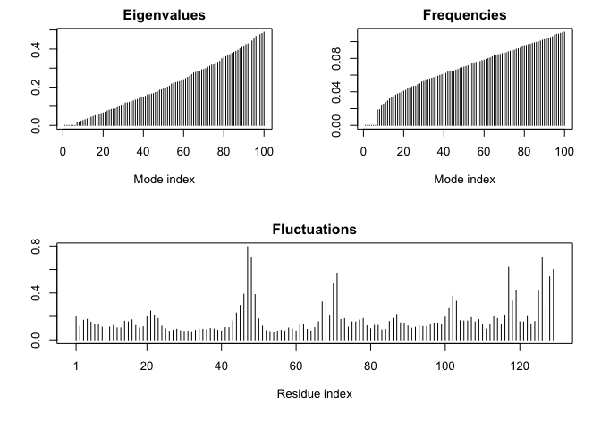

class13
================
Xuerui HUang
5/10/2019

# Section 1: In silico docking of drugs to HIV-1 protease

Obtaining and inspecting our input structure

``` r
#load pacakge required
library(bio3d)

#get data
file.name <- get.pdb("1HSG")
```

    ## Warning in get.pdb("1HSG"): ./1HSG.pdb exists. Skipping download

``` r
hiv <- read.pdb(file.name)
hiv  #print data
```

    ## 
    ##  Call:  read.pdb(file = file.name)
    ## 
    ##    Total Models#: 1
    ##      Total Atoms#: 1686,  XYZs#: 5058  Chains#: 2  (values: A B)
    ## 
    ##      Protein Atoms#: 1514  (residues/Calpha atoms#: 198)
    ##      Nucleic acid Atoms#: 0  (residues/phosphate atoms#: 0)
    ## 
    ##      Non-protein/nucleic Atoms#: 172  (residues: 128)
    ##      Non-protein/nucleic resid values: [ HOH (127), MK1 (1) ]
    ## 
    ##    Protein sequence:
    ##       PQITLWQRPLVTIKIGGQLKEALLDTGADDTVLEEMSLPGRWKPKMIGGIGGFIKVRQYD
    ##       QILIEICGHKAIGTVLVGPTPVNIIGRNLLTQIGCTLNFPQITLWQRPLVTIKIGGQLKE
    ##       ALLDTGADDTVLEEMSLPGRWKPKMIGGIGGFIKVRQYDQILIEICGHKAIGTVLVGPTP
    ##       VNIIGRNLLTQIGCTLNF
    ## 
    ## + attr: atom, xyz, seqres, helix, sheet,
    ##         calpha, remark, call

``` r
# trim for desired info
prot <- trim.pdb(hiv, "protein")
prot
```

    ## 
    ##  Call:  trim.pdb(pdb = hiv, "protein")
    ## 
    ##    Total Models#: 1
    ##      Total Atoms#: 1514,  XYZs#: 4542  Chains#: 2  (values: A B)
    ## 
    ##      Protein Atoms#: 1514  (residues/Calpha atoms#: 198)
    ##      Nucleic acid Atoms#: 0  (residues/phosphate atoms#: 0)
    ## 
    ##      Non-protein/nucleic Atoms#: 0  (residues: 0)
    ##      Non-protein/nucleic resid values: [ none ]
    ## 
    ##    Protein sequence:
    ##       PQITLWQRPLVTIKIGGQLKEALLDTGADDTVLEEMSLPGRWKPKMIGGIGGFIKVRQYD
    ##       QILIEICGHKAIGTVLVGPTPVNIIGRNLLTQIGCTLNFPQITLWQRPLVTIKIGGQLKE
    ##       ALLDTGADDTVLEEMSLPGRWKPKMIGGIGGFIKVRQYDQILIEICGHKAIGTVLVGPTP
    ##       VNIIGRNLLTQIGCTLNF
    ## 
    ## + attr: atom, helix, sheet, seqres, xyz,
    ##         calpha, call

``` r
lig <- trim.pdb(hiv, "ligand")
lig
```

    ## 
    ##  Call:  trim.pdb(pdb = hiv, "ligand")
    ## 
    ##    Total Models#: 1
    ##      Total Atoms#: 45,  XYZs#: 135  Chains#: 1  (values: B)
    ## 
    ##      Protein Atoms#: 0  (residues/Calpha atoms#: 0)
    ##      Nucleic acid Atoms#: 0  (residues/phosphate atoms#: 0)
    ## 
    ##      Non-protein/nucleic Atoms#: 45  (residues: 1)
    ##      Non-protein/nucleic resid values: [ MK1 (1) ]
    ## 
    ## + attr: atom, helix, sheet, seqres, xyz,
    ##         calpha, call

``` r
#write file
write.pdb(prot,file="1hsg_protein.pdb")
write.pdb(lig, file="1hsg_ligand.pdb")
```

# Using R to do visulization

Load the data we got from VMD

``` r
res <- read.pdb("all.pdbqt",multi = TRUE)
res
```

    ## 
    ##  Call:  read.pdb(file = "all.pdbqt", multi = TRUE)
    ## 
    ##    Total Models#: 14
    ##      Total Atoms#: 50,  XYZs#: 2100  Chains#: 1  (values: B)
    ## 
    ##      Protein Atoms#: 0  (residues/Calpha atoms#: 0)
    ##      Nucleic acid Atoms#: 0  (residues/phosphate atoms#: 0)
    ## 
    ##      Non-protein/nucleic Atoms#: 50  (residues: 1)
    ##      Non-protein/nucleic resid values: [ MK1 (1) ]
    ## 
    ## + attr: atom, xyz, calpha, call

``` r
write.pdb(res,file = "resilts.pdb")

ori <- read.pdb("ligand.pdbqt")
rmsd(ori, res)
```

    ##  [1]  0.590 11.163 10.531  4.364 11.040  3.682  5.741  3.864  5.442 10.920
    ## [11]  4.318  6.249 11.084  8.929

# Section 3: Exploring the conformational dynamics of proteins

``` r
pdb <- read.pdb("1hel")
```

    ##   Note: Accessing on-line PDB file

``` r
modes <- nma( pdb )
```

    ##  Building Hessian...     Done in 0.017 seconds.
    ##  Diagonalizing Hessian...    Done in 0.115 seconds.

``` r
m7 <- mktrj(modes, mode=7, file="mode_7.pdb")

plot(modes)
```

<!-- -->

``` r
# Visualize NMA results
mktrj(modes, mode=7, file="nma_7.pdb")
```
