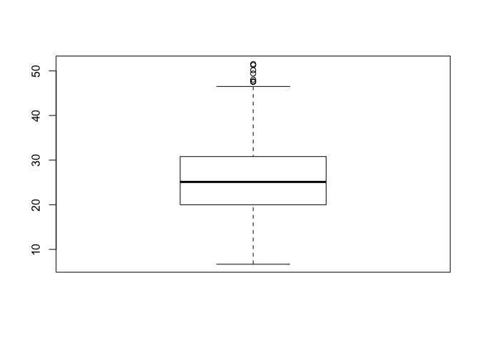
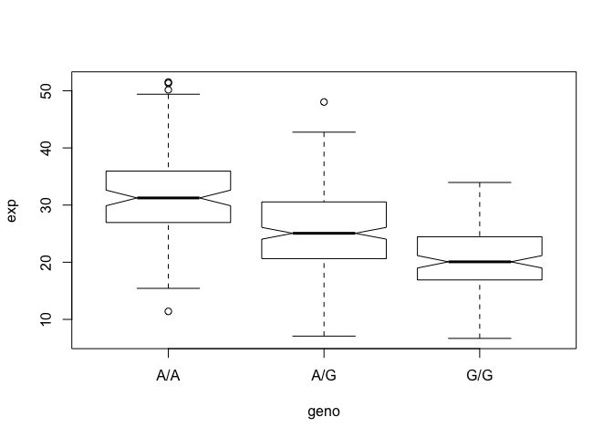

Class 13: Genome informatics and high throughput sequencing
================
Xuerui Huang
5/15/2019

# Plotting Expression values

``` r
library(seqinr)
library(gtools)
phred <- asc( s2c("DDDDCDEDCDDDDBBDDDCC@") ) - 33
phred
```

    ##  D  D  D  D  C  D  E  D  C  D  D  D  D  B  B  D  D  D  C  C  @ 
    ## 35 35 35 35 34 35 36 35 34 35 35 35 35 33 33 35 35 35 34 34 31

``` r
# laod data from url
expr <- read.csv("https://bioboot.github.io/bggn213_W19/class-material/rs8067378_ENSG00000172057.6.txt",sep = " ")

#Check data
summary(expr)
```

    ##      sample     geno          exp        
    ##  HG00096:  1   A/A:108   Min.   : 6.675  
    ##  HG00097:  1   A/G:233   1st Qu.:20.004  
    ##  HG00099:  1   G/G:121   Median :25.116  
    ##  HG00100:  1             Mean   :25.640  
    ##  HG00101:  1             3rd Qu.:30.779  
    ##  HG00102:  1             Max.   :51.518  
    ##  (Other):456

``` r
summary( expr[expr[,2] == "A/A",3] )
```

    ##    Min. 1st Qu.  Median    Mean 3rd Qu.    Max. 
    ##   11.40   27.02   31.25   31.82   35.92   51.52

``` r
summary( expr[expr[,2] == "G/G",3] )
```

    ##    Min. 1st Qu.  Median    Mean 3rd Qu.    Max. 
    ##   6.675  16.903  20.074  20.594  24.457  33.956

``` r
summary( expr[expr[,2] == "A/G",3] )
```

    ##    Min. 1st Qu.  Median    Mean 3rd Qu.    Max. 
    ##   7.075  20.626  25.065  25.397  30.552  48.034

``` r
#plot boxplot
boxplot(expr$exp,group = expr$geno)
```

<!-- -->

``` r
#plot
p <- boxplot(exp~geno,data = expr,notch = TRUE)
```

<!-- -->

``` r
p
```

    ## $stats
    ##          [,1]     [,2]     [,3]
    ## [1,] 15.42908  7.07505  6.67482
    ## [2,] 26.95022 20.62572 16.90256
    ## [3,] 31.24847 25.06486 20.07363
    ## [4,] 35.95503 30.55183 24.45672
    ## [5,] 49.39612 42.75662 33.95602
    ## 
    ## $n
    ## [1] 108 233 121
    ## 
    ## $conf
    ##          [,1]     [,2]     [,3]
    ## [1,] 29.87942 24.03742 18.98858
    ## [2,] 32.61753 26.09230 21.15868
    ## 
    ## $out
    ## [1] 51.51787 50.16704 51.30170 11.39643 48.03410
    ## 
    ## $group
    ## [1] 1 1 1 1 2
    ## 
    ## $names
    ## [1] "A/A" "A/G" "G/G"

Generate some nice plots
