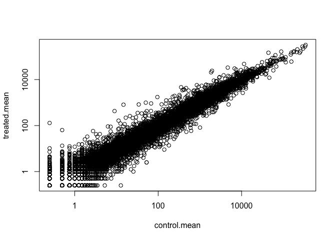
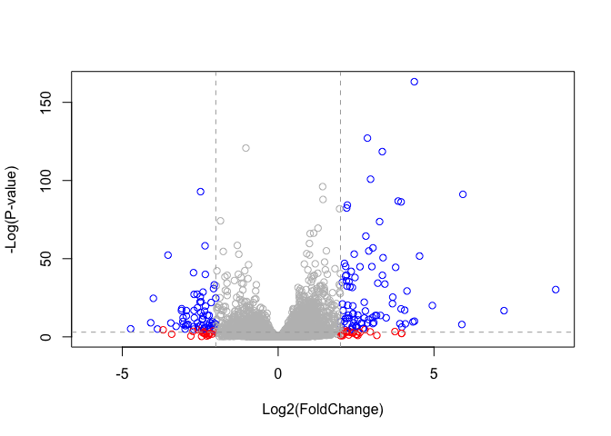

class14: Transcriptomics and the analysis of RNA-Seq data
================
Xuerui Huang
5/17/2019

\#load package

``` r
library(DESeq2)
library(pcaExplorer)
library(tidyverse)

library("org.Hs.eg.db")
```

# Import countData and colData

``` r
#load data
counts <- read.csv("airway_scaledcounts.csv", stringsAsFactors = FALSE)
head(counts)
```

    ##           ensgene SRR1039508 SRR1039509 SRR1039512 SRR1039513 SRR1039516
    ## 1 ENSG00000000003        723        486        904        445       1170
    ## 2 ENSG00000000005          0          0          0          0          0
    ## 3 ENSG00000000419        467        523        616        371        582
    ## 4 ENSG00000000457        347        258        364        237        318
    ## 5 ENSG00000000460         96         81         73         66        118
    ## 6 ENSG00000000938          0          0          1          0          2
    ##   SRR1039517 SRR1039520 SRR1039521
    ## 1       1097        806        604
    ## 2          0          0          0
    ## 3        781        417        509
    ## 4        447        330        324
    ## 5         94        102         74
    ## 6          0          0          0

``` r
metadata <-  read.csv("airway_metadata.csv", stringsAsFactors = FALSE)
head(metadata)
```

    ##           id     dex celltype     geo_id
    ## 1 SRR1039508 control   N61311 GSM1275862
    ## 2 SRR1039509 treated   N61311 GSM1275863
    ## 3 SRR1039512 control  N052611 GSM1275866
    ## 4 SRR1039513 treated  N052611 GSM1275867
    ## 5 SRR1039516 control  N080611 GSM1275870
    ## 6 SRR1039517 treated  N080611 GSM1275871

``` r
#check whether samples names are in the same order 
all.equal(colnames(counts)[-1],metadata$id)
```

    ## [1] TRUE

# 3\. Toy differential gene expression

``` r
#control
control <- metadata[metadata[,"dex"]=="control",]
control.mean <- rowSums( counts[ ,control$id] )/4 
names(control.mean) <- counts$ensgene
head(control.mean)
```

    ## ENSG00000000003 ENSG00000000005 ENSG00000000419 ENSG00000000457 
    ##          900.75            0.00          520.50          339.75 
    ## ENSG00000000460 ENSG00000000938 
    ##           97.25            0.75

``` r
#treatment
treatment <- metadata[metadata[,"dex"]=="treated",]
treated.mean <- rowSums(counts[ ,treatment$id] )/ncol(treatment)
names(treated.mean) <- counts$ensgene
head(treated.mean)
```

    ## ENSG00000000003 ENSG00000000005 ENSG00000000419 ENSG00000000457 
    ##          658.00            0.00          546.00          316.50 
    ## ENSG00000000460 ENSG00000000938 
    ##           78.75            0.00

``` r
#combine two groups of data
meancounts <- data.frame(control.mean, treated.mean)

#plot log2 fold change 
plot(meancounts,log="xy")
```

    ## Warning in xy.coords(x, y, xlabel, ylabel, log): 15032 x values <= 0
    ## omitted from logarithmic plot

    ## Warning in xy.coords(x, y, xlabel, ylabel, log): 15281 y values <= 0
    ## omitted from logarithmic plot

<!-- -->

``` r
# log2foldChange
meancounts$log2fc <- log2(meancounts[,"treated.mean"]/meancounts[,"control.mean"])
head(meancounts)
```

    ##                 control.mean treated.mean      log2fc
    ## ENSG00000000003       900.75       658.00 -0.45303916
    ## ENSG00000000005         0.00         0.00         NaN
    ## ENSG00000000419       520.50       546.00  0.06900279
    ## ENSG00000000457       339.75       316.50 -0.10226805
    ## ENSG00000000460        97.25        78.75 -0.30441833
    ## ENSG00000000938         0.75         0.00        -Inf

``` r
zero.vals <- which(meancounts[,1:2]==0, arr.ind=TRUE)

to.rm <- unique(zero.vals[,1])
mycounts <- meancounts[-to.rm,]
head(mycounts)
```

    ##                 control.mean treated.mean      log2fc
    ## ENSG00000000003       900.75       658.00 -0.45303916
    ## ENSG00000000419       520.50       546.00  0.06900279
    ## ENSG00000000457       339.75       316.50 -0.10226805
    ## ENSG00000000460        97.25        78.75 -0.30441833
    ## ENSG00000000971      5219.00      6687.50  0.35769358
    ## ENSG00000001036      2327.00      1785.75 -0.38194109

``` r
#count up and down regulated genes
mycounts[mycounts$log2fc>2,] %>% nrow(.) #number of up regulated genes
```

    ## [1] 250

``` r
mycounts[mycounts$log2fc<(-2),]%>% nrow(.) #number of down regulated genes
```

    ## [1] 367

# Adding annotation data

``` r
anno <- read.csv("annotables_grch38.csv")
merge_df <- merge(mycounts,anno,by.x = "row.names",by.y = "ensgene")
```

# Annotation by using AnnotationDbi

``` r
columns(org.Hs.eg.db)
```

    ##  [1] "ACCNUM"       "ALIAS"        "ENSEMBL"      "ENSEMBLPROT" 
    ##  [5] "ENSEMBLTRANS" "ENTREZID"     "ENZYME"       "EVIDENCE"    
    ##  [9] "EVIDENCEALL"  "GENENAME"     "GO"           "GOALL"       
    ## [13] "IPI"          "MAP"          "OMIM"         "ONTOLOGY"    
    ## [17] "ONTOLOGYALL"  "PATH"         "PFAM"         "PMID"        
    ## [21] "PROSITE"      "REFSEQ"       "SYMBOL"       "UCSCKG"      
    ## [25] "UNIGENE"      "UNIPROT"

``` r
# get anno info as input a vector
anno_info_Hs <- AnnotationDbi::select(org.Hs.eg.db, keys=rownames(mycounts), 
                                      columns=c("SYMBOL","ENTREZID","UNIPROT"), keytype="ENSEMBL")
```

    ## 'select()' returned 1:many mapping between keys and columns

``` r
mycounts <- merge(mycounts,anno_info_Hs,by.x = "row.names",by.y = "ENSEMBL")
```

# Unsing DESeq package to do the analysis

``` r
dds <- DESeqDataSetFromMatrix(countData=counts, 
                              colData=metadata, 
                              design=~dex, 
                              tidy=TRUE)
```

    ## converting counts to integer mode

    ## Warning in DESeqDataSet(se, design = design, ignoreRank): some variables in
    ## design formula are characters, converting to factors

``` r
# get the result
res <- DESeq(dds) %>% results(.)
```

    ## estimating size factors

    ## estimating dispersions

    ## gene-wise dispersion estimates

    ## mean-dispersion relationship

    ## final dispersion estimates

    ## fitting model and testing

``` r
summary(res)
```

    ## 
    ## out of 25258 with nonzero total read count
    ## adjusted p-value < 0.1
    ## LFC > 0 (up)       : 1563, 6.2%
    ## LFC < 0 (down)     : 1188, 4.7%
    ## outliers [1]       : 142, 0.56%
    ## low counts [2]     : 9971, 39%
    ## (mean count < 10)
    ## [1] see 'cooksCutoff' argument of ?results
    ## [2] see 'independentFiltering' argument of ?results

# Data Visualization

Plot Volcano plots

``` r
# Setup our custom point color vector 
mycols <- rep("gray", nrow(res))
mycols[ abs(res$log2FoldChange) > 2 ]  <- "red" 

inds <- (res$padj < 0.01) & (abs(res$log2FoldChange) > 2 )
mycols[ inds ] <- "blue"

# Volcano plot with custom colors 
plot( res$log2FoldChange,  -log(res$padj), 
 col=mycols, ylab="-Log(P-value)", xlab="Log2(FoldChange)" )

# Add some cut-off lines
abline(v=c(-2,2), col="darkgray", lty=2)
abline(h=-log(0.05), col="darkgray", lty=2)
```

<!-- -->
