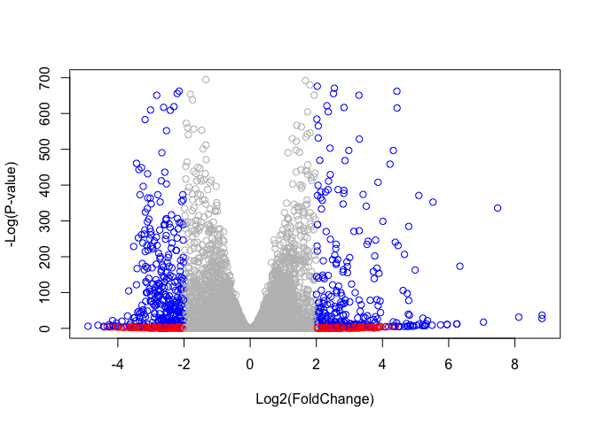

Class15: Genome annotation and the interpretation of gene lists
================
Xuerui Huang
5/22/2019

# Load Packages

# load and Process Data

``` r
metaFile <- "GSE37704_metadata.csv"
countFile <- "GSE37704_featurecounts.csv"

# Import metadata and take a peak
colData = read.csv(metaFile, row.names=1)
head(colData)
```

    ##               condition
    ## SRR493366 control_sirna
    ## SRR493367 control_sirna
    ## SRR493368 control_sirna
    ## SRR493369      hoxa1_kd
    ## SRR493370      hoxa1_kd
    ## SRR493371      hoxa1_kd

``` r
# Import countdata
countData = read.csv(countFile, row.names=1)
head(countData)
```

    ##                 length SRR493366 SRR493367 SRR493368 SRR493369 SRR493370
    ## ENSG00000186092    918         0         0         0         0         0
    ## ENSG00000279928    718         0         0         0         0         0
    ## ENSG00000279457   1982        23        28        29        29        28
    ## ENSG00000278566    939         0         0         0         0         0
    ## ENSG00000273547    939         0         0         0         0         0
    ## ENSG00000187634   3214       124       123       205       207       212
    ##                 SRR493371
    ## ENSG00000186092         0
    ## ENSG00000279928         0
    ## ENSG00000279457        46
    ## ENSG00000278566         0
    ## ENSG00000273547         0
    ## ENSG00000187634       258

Process
Data

``` r
# Remove length column to make sure the row and column number are the same
countData$length <- NULL

# remove the rows that all rows are zero
countData <- countData[rowSums(countData)>0,]
head(countData)
```

    ##                 SRR493366 SRR493367 SRR493368 SRR493369 SRR493370
    ## ENSG00000279457        23        28        29        29        28
    ## ENSG00000187634       124       123       205       207       212
    ## ENSG00000188976      1637      1831      2383      1226      1326
    ## ENSG00000187961       120       153       180       236       255
    ## ENSG00000187583        24        48        65        44        48
    ## ENSG00000187642         4         9        16        14        16
    ##                 SRR493371
    ## ENSG00000279457        46
    ## ENSG00000187634       258
    ## ENSG00000188976      1504
    ## ENSG00000187961       357
    ## ENSG00000187583        64
    ## ENSG00000187642        16

# DESeq

## Running DESeq

``` r
dds <-  DESeqDataSetFromMatrix(countData=countData,
                             colData=colData,
                             design=~condition)
dds <-  DESeq(dds)
```

    ## estimating size factors

    ## estimating dispersions

    ## gene-wise dispersion estimates

    ## mean-dispersion relationship

    ## final dispersion estimates

    ## fitting model and testing

``` r
res <-  results(dds) %>% as.data.frame(.)

summary(res) # 4396 genes, which is 28% of the total genes, are down regulated
```

    ##     baseMean        log2FoldChange          lfcSE        
    ##  Min.   :     0.1   Min.   :-4.902884   Min.   :0.03163  
    ##  1st Qu.:    12.1   1st Qu.:-0.459361   1st Qu.:0.07507  
    ##  Median :   214.8   Median : 0.008707   Median :0.13108  
    ##  Mean   :  1002.1   Mean   : 0.015164   Mean   :0.60432  
    ##  3rd Qu.:   774.3   3rd Qu.: 0.508047   3rd Qu.:0.53867  
    ##  Max.   :399481.5   Max.   : 8.822085   Max.   :4.08047  
    ##                                                          
    ##       stat               pvalue             padj       
    ##  Min.   :-52.97126   Min.   :0.00000   Min.   :0.0000  
    ##  1st Qu.: -2.34434   1st Qu.:0.00000   1st Qu.:0.0000  
    ##  Median :  0.05028   Median :0.02204   Median :0.0163  
    ##  Mean   : -0.08060   Mean   :0.24012   Mean   :0.2300  
    ##  3rd Qu.:  2.22749   3rd Qu.:0.47941   3rd Qu.:0.4411  
    ##  Max.   : 48.42078   Max.   :0.99997   Max.   :1.0000  
    ##                                        NA's   :1237

## Making plot based on the result

``` r
# Plot volcano plot
plot( res$log2FoldChange, -log(res$padj) )
```

<!-- -->

``` r
# plot more advanced verison of volcano plot
# Make a color vector for all genes
mycols <- rep("gray", nrow(res) )

# Color red the genes with absolute fold change above 2
mycols[ abs(res$log2FoldChange) > 2 ] <- "red"

# Color blue those with adjusted p-value less than 0.01
#  and absolute fold change more than 2
inds <- (res$padj<0.01) & (abs(res$log2FoldChange) > 2 )
mycols[ inds ] <- "blue"

plot( res$log2FoldChange, -log(res$padj), col=mycols, xlab="Log2(FoldChange)", ylab="-Log(P-value)" )
```

<!-- -->

## Get annotation of DESeq Genes

``` r
library("AnnotationDbi")
```

    ## 
    ## Attaching package: 'AnnotationDbi'

    ## The following object is masked from 'package:dplyr':
    ## 
    ##     select

``` r
library("org.Hs.eg.db")
```

    ## 

``` r
anno_info_Hs <- AnnotationDbi::select(org.Hs.eg.db, keys=rownames(res), 
                                      columns=c("SYMBOL","ENTREZID","GENENAME"), keytype="ENSEMBL",multiVals="first")
```

    ## 'select()' returned 1:many mapping between keys and columns

``` r
res <- merge(res,anno_info_Hs,by.x = "row.names",by.y = "ENSEMBL")
colnames(res)[8:10] <- c("symbol","entrez","name")
#column_to_rownames(res,"Row.names")

# output DESeq genes to a file named deseq_results.csv
res = res[order(res$pvalue),]
write.csv(res,"deseq_results.csv")
```

# KEGG pathways

## Load Packages and Data

    ## $`hsa00232 Caffeine metabolism`
    ## [1] "10"   "1544" "1548" "1549" "1553" "7498" "9"   
    ## 
    ## $`hsa00983 Drug metabolism - other enzymes`
    ##  [1] "10"     "1066"   "10720"  "10941"  "151531" "1548"   "1549"  
    ##  [8] "1551"   "1553"   "1576"   "1577"   "1806"   "1807"   "1890"  
    ## [15] "221223" "2990"   "3251"   "3614"   "3615"   "3704"   "51733" 
    ## [22] "54490"  "54575"  "54576"  "54577"  "54578"  "54579"  "54600" 
    ## [29] "54657"  "54658"  "54659"  "54963"  "574537" "64816"  "7083"  
    ## [36] "7084"   "7172"   "7363"   "7364"   "7365"   "7366"   "7367"  
    ## [43] "7371"   "7372"   "7378"   "7498"   "79799"  "83549"  "8824"  
    ## [50] "8833"   "9"      "978"   
    ## 
    ## $`hsa00230 Purine metabolism`
    ##   [1] "100"    "10201"  "10606"  "10621"  "10622"  "10623"  "107"   
    ##   [8] "10714"  "108"    "10846"  "109"    "111"    "11128"  "11164" 
    ##  [15] "112"    "113"    "114"    "115"    "122481" "122622" "124583"
    ##  [22] "132"    "158"    "159"    "1633"   "171568" "1716"   "196883"
    ##  [29] "203"    "204"    "205"    "221823" "2272"   "22978"  "23649" 
    ##  [36] "246721" "25885"  "2618"   "26289"  "270"    "271"    "27115" 
    ##  [43] "272"    "2766"   "2977"   "2982"   "2983"   "2984"   "2986"  
    ##  [50] "2987"   "29922"  "3000"   "30833"  "30834"  "318"    "3251"  
    ##  [57] "353"    "3614"   "3615"   "3704"   "377841" "471"    "4830"  
    ##  [64] "4831"   "4832"   "4833"   "4860"   "4881"   "4882"   "4907"  
    ##  [71] "50484"  "50940"  "51082"  "51251"  "51292"  "5136"   "5137"  
    ##  [78] "5138"   "5139"   "5140"   "5141"   "5142"   "5143"   "5144"  
    ##  [85] "5145"   "5146"   "5147"   "5148"   "5149"   "5150"   "5151"  
    ##  [92] "5152"   "5153"   "5158"   "5167"   "5169"   "51728"  "5198"  
    ##  [99] "5236"   "5313"   "5315"   "53343"  "54107"  "5422"   "5424"  
    ## [106] "5425"   "5426"   "5427"   "5430"   "5431"   "5432"   "5433"  
    ## [113] "5434"   "5435"   "5436"   "5437"   "5438"   "5439"   "5440"  
    ## [120] "5441"   "5471"   "548644" "55276"  "5557"   "5558"   "55703" 
    ## [127] "55811"  "55821"  "5631"   "5634"   "56655"  "56953"  "56985" 
    ## [134] "57804"  "58497"  "6240"   "6241"   "64425"  "646625" "654364"
    ## [141] "661"    "7498"   "8382"   "84172"  "84265"  "84284"  "84618" 
    ## [148] "8622"   "8654"   "87178"  "8833"   "9060"   "9061"   "93034" 
    ## [155] "953"    "9533"   "954"    "955"    "956"    "957"    "9583"  
    ## [162] "9615"

## Perform Kegg

``` r
foldchanges = res$log2FoldChange
names(foldchanges) = res$entrez
head(foldchanges)
```

    ##      6515      5054      2034      1266      5328     10376 
    ##  2.079763 -1.844046 -1.888019 -2.422719  2.262525 -1.938418

``` r
# Get the results
keggres = gage(foldchanges, gsets=kegg.sets.hs)

attributes(keggres)
```

    ## $names
    ## [1] "greater" "less"    "stats"

``` r
head(keggres$less)
```

    ##                                          p.geomean stat.mean        p.val
    ## hsa04110 Cell cycle                   8.906845e-06 -4.381008 8.906845e-06
    ## hsa03030 DNA replication              9.341778e-05 -3.954320 9.341778e-05
    ## hsa03013 RNA transport                1.371403e-03 -3.029333 1.371403e-03
    ## hsa03440 Homologous recombination     3.052591e-03 -2.854586 3.052591e-03
    ## hsa04114 Oocyte meiosis               3.765226e-03 -2.699897 3.765226e-03
    ## hsa00010 Glycolysis / Gluconeogenesis 8.923804e-03 -2.407021 8.923804e-03
    ##                                             q.val set.size         exp1
    ## hsa04110 Cell cycle                   0.001434002      121 8.906845e-06
    ## hsa03030 DNA replication              0.007520132       36 9.341778e-05
    ## hsa03013 RNA transport                0.073598640      145 1.371403e-03
    ## hsa03440 Homologous recombination     0.121240276       28 3.052591e-03
    ## hsa04114 Oocyte meiosis               0.121240276      102 3.765226e-03
    ## hsa00010 Glycolysis / Gluconeogenesis 0.211525961       53 8.923804e-03

``` r
#PDF output based on data
pathview(gene.data=foldchanges, pathway.id="hsa04110")
```

    ## 'select()' returned 1:1 mapping between keys and columns

    ## Info: Working in directory /Users/Sherry/UCSD Drive/BGGN213/BGGN213_github/class15

    ## Info: Writing image file hsa04110.pathview.png

 More plot

``` r
## Focus on top 5 upregulated pathways here for demo purposes only
keggrespathways <- rownames(keggres$greater)[1:5]

# Extract the 8 character long IDs part of each string
keggresids = substr(keggrespathways, start=1, stop=8)
keggresids
```

    ## [1] "hsa04640" "hsa04630" "hsa00140" "hsa04142" "hsa04330"

``` r
pathview(gene.data=foldchanges, pathway.id=keggresids, species="hsa")
```

    ## 'select()' returned 1:1 mapping between keys and columns

    ## Info: Working in directory /Users/Sherry/UCSD Drive/BGGN213/BGGN213_github/class15

    ## Info: Writing image file hsa04640.pathview.png

    ## 'select()' returned 1:1 mapping between keys and columns

    ## Info: Working in directory /Users/Sherry/UCSD Drive/BGGN213/BGGN213_github/class15

    ## Info: Writing image file hsa04630.pathview.png

    ## Warning in structure(x$children, class = "XMLNodeList"): Calling 'structure(NULL, *)' is deprecated, as NULL cannot have attributes.
    ##   Consider 'structure(list(), *)' instead.
    
    ## Warning in structure(x$children, class = "XMLNodeList"): Calling 'structure(NULL, *)' is deprecated, as NULL cannot have attributes.
    ##   Consider 'structure(list(), *)' instead.
    
    ## Warning in structure(x$children, class = "XMLNodeList"): Calling 'structure(NULL, *)' is deprecated, as NULL cannot have attributes.
    ##   Consider 'structure(list(), *)' instead.
    
    ## Warning in structure(x$children, class = "XMLNodeList"): Calling 'structure(NULL, *)' is deprecated, as NULL cannot have attributes.
    ##   Consider 'structure(list(), *)' instead.
    
    ## Warning in structure(x$children, class = "XMLNodeList"): Calling 'structure(NULL, *)' is deprecated, as NULL cannot have attributes.
    ##   Consider 'structure(list(), *)' instead.
    
    ## Warning in structure(x$children, class = "XMLNodeList"): Calling 'structure(NULL, *)' is deprecated, as NULL cannot have attributes.
    ##   Consider 'structure(list(), *)' instead.
    
    ## Warning in structure(x$children, class = "XMLNodeList"): Calling 'structure(NULL, *)' is deprecated, as NULL cannot have attributes.
    ##   Consider 'structure(list(), *)' instead.
    
    ## Warning in structure(x$children, class = "XMLNodeList"): Calling 'structure(NULL, *)' is deprecated, as NULL cannot have attributes.
    ##   Consider 'structure(list(), *)' instead.
    
    ## Warning in structure(x$children, class = "XMLNodeList"): Calling 'structure(NULL, *)' is deprecated, as NULL cannot have attributes.
    ##   Consider 'structure(list(), *)' instead.
    
    ## Warning in structure(x$children, class = "XMLNodeList"): Calling 'structure(NULL, *)' is deprecated, as NULL cannot have attributes.
    ##   Consider 'structure(list(), *)' instead.
    
    ## Warning in structure(x$children, class = "XMLNodeList"): Calling 'structure(NULL, *)' is deprecated, as NULL cannot have attributes.
    ##   Consider 'structure(list(), *)' instead.
    
    ## Warning in structure(x$children, class = "XMLNodeList"): Calling 'structure(NULL, *)' is deprecated, as NULL cannot have attributes.
    ##   Consider 'structure(list(), *)' instead.
    
    ## Warning in structure(x$children, class = "XMLNodeList"): Calling 'structure(NULL, *)' is deprecated, as NULL cannot have attributes.
    ##   Consider 'structure(list(), *)' instead.
    
    ## Warning in structure(x$children, class = "XMLNodeList"): Calling 'structure(NULL, *)' is deprecated, as NULL cannot have attributes.
    ##   Consider 'structure(list(), *)' instead.
    
    ## Warning in structure(x$children, class = "XMLNodeList"): Calling 'structure(NULL, *)' is deprecated, as NULL cannot have attributes.
    ##   Consider 'structure(list(), *)' instead.
    
    ## Warning in structure(x$children, class = "XMLNodeList"): Calling 'structure(NULL, *)' is deprecated, as NULL cannot have attributes.
    ##   Consider 'structure(list(), *)' instead.
    
    ## Warning in structure(x$children, class = "XMLNodeList"): Calling 'structure(NULL, *)' is deprecated, as NULL cannot have attributes.
    ##   Consider 'structure(list(), *)' instead.
    
    ## Warning in structure(x$children, class = "XMLNodeList"): Calling 'structure(NULL, *)' is deprecated, as NULL cannot have attributes.
    ##   Consider 'structure(list(), *)' instead.
    
    ## Warning in structure(x$children, class = "XMLNodeList"): Calling 'structure(NULL, *)' is deprecated, as NULL cannot have attributes.
    ##   Consider 'structure(list(), *)' instead.
    
    ## Warning in structure(x$children, class = "XMLNodeList"): Calling 'structure(NULL, *)' is deprecated, as NULL cannot have attributes.
    ##   Consider 'structure(list(), *)' instead.
    
    ## Warning in structure(x$children, class = "XMLNodeList"): Calling 'structure(NULL, *)' is deprecated, as NULL cannot have attributes.
    ##   Consider 'structure(list(), *)' instead.
    
    ## Warning in structure(x$children, class = "XMLNodeList"): Calling 'structure(NULL, *)' is deprecated, as NULL cannot have attributes.
    ##   Consider 'structure(list(), *)' instead.
    
    ## Warning in structure(x$children, class = "XMLNodeList"): Calling 'structure(NULL, *)' is deprecated, as NULL cannot have attributes.
    ##   Consider 'structure(list(), *)' instead.
    
    ## Warning in structure(x$children, class = "XMLNodeList"): Calling 'structure(NULL, *)' is deprecated, as NULL cannot have attributes.
    ##   Consider 'structure(list(), *)' instead.
    
    ## Warning in structure(x$children, class = "XMLNodeList"): Calling 'structure(NULL, *)' is deprecated, as NULL cannot have attributes.
    ##   Consider 'structure(list(), *)' instead.
    
    ## Warning in structure(x$children, class = "XMLNodeList"): Calling 'structure(NULL, *)' is deprecated, as NULL cannot have attributes.
    ##   Consider 'structure(list(), *)' instead.
    
    ## Warning in structure(x$children, class = "XMLNodeList"): Calling 'structure(NULL, *)' is deprecated, as NULL cannot have attributes.
    ##   Consider 'structure(list(), *)' instead.
    
    ## Warning in structure(x$children, class = "XMLNodeList"): Calling 'structure(NULL, *)' is deprecated, as NULL cannot have attributes.
    ##   Consider 'structure(list(), *)' instead.
    
    ## Warning in structure(x$children, class = "XMLNodeList"): Calling 'structure(NULL, *)' is deprecated, as NULL cannot have attributes.
    ##   Consider 'structure(list(), *)' instead.
    
    ## Warning in structure(x$children, class = "XMLNodeList"): Calling 'structure(NULL, *)' is deprecated, as NULL cannot have attributes.
    ##   Consider 'structure(list(), *)' instead.
    
    ## Warning in structure(x$children, class = "XMLNodeList"): Calling 'structure(NULL, *)' is deprecated, as NULL cannot have attributes.
    ##   Consider 'structure(list(), *)' instead.
    
    ## Warning in structure(x$children, class = "XMLNodeList"): Calling 'structure(NULL, *)' is deprecated, as NULL cannot have attributes.
    ##   Consider 'structure(list(), *)' instead.
    
    ## Warning in structure(x$children, class = "XMLNodeList"): Calling 'structure(NULL, *)' is deprecated, as NULL cannot have attributes.
    ##   Consider 'structure(list(), *)' instead.
    
    ## Warning in structure(x$children, class = "XMLNodeList"): Calling 'structure(NULL, *)' is deprecated, as NULL cannot have attributes.
    ##   Consider 'structure(list(), *)' instead.
    
    ## Warning in structure(x$children, class = "XMLNodeList"): Calling 'structure(NULL, *)' is deprecated, as NULL cannot have attributes.
    ##   Consider 'structure(list(), *)' instead.
    
    ## Warning in structure(x$children, class = "XMLNodeList"): Calling 'structure(NULL, *)' is deprecated, as NULL cannot have attributes.
    ##   Consider 'structure(list(), *)' instead.
    
    ## Warning in structure(x$children, class = "XMLNodeList"): Calling 'structure(NULL, *)' is deprecated, as NULL cannot have attributes.
    ##   Consider 'structure(list(), *)' instead.
    
    ## Warning in structure(x$children, class = "XMLNodeList"): Calling 'structure(NULL, *)' is deprecated, as NULL cannot have attributes.
    ##   Consider 'structure(list(), *)' instead.
    
    ## Warning in structure(x$children, class = "XMLNodeList"): Calling 'structure(NULL, *)' is deprecated, as NULL cannot have attributes.
    ##   Consider 'structure(list(), *)' instead.
    
    ## Warning in structure(x$children, class = "XMLNodeList"): Calling 'structure(NULL, *)' is deprecated, as NULL cannot have attributes.
    ##   Consider 'structure(list(), *)' instead.
    
    ## Warning in structure(x$children, class = "XMLNodeList"): Calling 'structure(NULL, *)' is deprecated, as NULL cannot have attributes.
    ##   Consider 'structure(list(), *)' instead.
    
    ## Warning in structure(x$children, class = "XMLNodeList"): Calling 'structure(NULL, *)' is deprecated, as NULL cannot have attributes.
    ##   Consider 'structure(list(), *)' instead.
    
    ## Warning in structure(x$children, class = "XMLNodeList"): Calling 'structure(NULL, *)' is deprecated, as NULL cannot have attributes.
    ##   Consider 'structure(list(), *)' instead.
    
    ## Warning in structure(x$children, class = "XMLNodeList"): Calling 'structure(NULL, *)' is deprecated, as NULL cannot have attributes.
    ##   Consider 'structure(list(), *)' instead.
    
    ## Warning in structure(x$children, class = "XMLNodeList"): Calling 'structure(NULL, *)' is deprecated, as NULL cannot have attributes.
    ##   Consider 'structure(list(), *)' instead.
    
    ## Warning in structure(x$children, class = "XMLNodeList"): Calling 'structure(NULL, *)' is deprecated, as NULL cannot have attributes.
    ##   Consider 'structure(list(), *)' instead.
    
    ## Warning in structure(x$children, class = "XMLNodeList"): Calling 'structure(NULL, *)' is deprecated, as NULL cannot have attributes.
    ##   Consider 'structure(list(), *)' instead.
    
    ## Warning in structure(x$children, class = "XMLNodeList"): Calling 'structure(NULL, *)' is deprecated, as NULL cannot have attributes.
    ##   Consider 'structure(list(), *)' instead.
    
    ## Warning in structure(x$children, class = "XMLNodeList"): Calling 'structure(NULL, *)' is deprecated, as NULL cannot have attributes.
    ##   Consider 'structure(list(), *)' instead.
    
    ## Warning in structure(x$children, class = "XMLNodeList"): Calling 'structure(NULL, *)' is deprecated, as NULL cannot have attributes.
    ##   Consider 'structure(list(), *)' instead.
    
    ## Warning in structure(x$children, class = "XMLNodeList"): Calling 'structure(NULL, *)' is deprecated, as NULL cannot have attributes.
    ##   Consider 'structure(list(), *)' instead.
    
    ## Warning in structure(x$children, class = "XMLNodeList"): Calling 'structure(NULL, *)' is deprecated, as NULL cannot have attributes.
    ##   Consider 'structure(list(), *)' instead.
    
    ## Warning in structure(x$children, class = "XMLNodeList"): Calling 'structure(NULL, *)' is deprecated, as NULL cannot have attributes.
    ##   Consider 'structure(list(), *)' instead.
    
    ## Warning in structure(x$children, class = "XMLNodeList"): Calling 'structure(NULL, *)' is deprecated, as NULL cannot have attributes.
    ##   Consider 'structure(list(), *)' instead.
    
    ## Warning in structure(x$children, class = "XMLNodeList"): Calling 'structure(NULL, *)' is deprecated, as NULL cannot have attributes.
    ##   Consider 'structure(list(), *)' instead.
    
    ## Warning in structure(x$children, class = "XMLNodeList"): Calling 'structure(NULL, *)' is deprecated, as NULL cannot have attributes.
    ##   Consider 'structure(list(), *)' instead.
    
    ## Warning in structure(x$children, class = "XMLNodeList"): Calling 'structure(NULL, *)' is deprecated, as NULL cannot have attributes.
    ##   Consider 'structure(list(), *)' instead.
    
    ## Warning in structure(x$children, class = "XMLNodeList"): Calling 'structure(NULL, *)' is deprecated, as NULL cannot have attributes.
    ##   Consider 'structure(list(), *)' instead.
    
    ## Warning in structure(x$children, class = "XMLNodeList"): Calling 'structure(NULL, *)' is deprecated, as NULL cannot have attributes.
    ##   Consider 'structure(list(), *)' instead.
    
    ## Warning in structure(x$children, class = "XMLNodeList"): Calling 'structure(NULL, *)' is deprecated, as NULL cannot have attributes.
    ##   Consider 'structure(list(), *)' instead.
    
    ## Warning in structure(x$children, class = "XMLNodeList"): Calling 'structure(NULL, *)' is deprecated, as NULL cannot have attributes.
    ##   Consider 'structure(list(), *)' instead.
    
    ## Warning in structure(x$children, class = "XMLNodeList"): Calling 'structure(NULL, *)' is deprecated, as NULL cannot have attributes.
    ##   Consider 'structure(list(), *)' instead.
    
    ## Warning in structure(x$children, class = "XMLNodeList"): Calling 'structure(NULL, *)' is deprecated, as NULL cannot have attributes.
    ##   Consider 'structure(list(), *)' instead.
    
    ## Warning in structure(x$children, class = "XMLNodeList"): Calling 'structure(NULL, *)' is deprecated, as NULL cannot have attributes.
    ##   Consider 'structure(list(), *)' instead.
    
    ## Warning in structure(x$children, class = "XMLNodeList"): Calling 'structure(NULL, *)' is deprecated, as NULL cannot have attributes.
    ##   Consider 'structure(list(), *)' instead.
    
    ## Warning in structure(x$children, class = "XMLNodeList"): Calling 'structure(NULL, *)' is deprecated, as NULL cannot have attributes.
    ##   Consider 'structure(list(), *)' instead.
    
    ## Warning in structure(x$children, class = "XMLNodeList"): Calling 'structure(NULL, *)' is deprecated, as NULL cannot have attributes.
    ##   Consider 'structure(list(), *)' instead.
    
    ## Warning in structure(x$children, class = "XMLNodeList"): Calling 'structure(NULL, *)' is deprecated, as NULL cannot have attributes.
    ##   Consider 'structure(list(), *)' instead.
    
    ## Warning in structure(x$children, class = "XMLNodeList"): Calling 'structure(NULL, *)' is deprecated, as NULL cannot have attributes.
    ##   Consider 'structure(list(), *)' instead.
    
    ## Warning in structure(x$children, class = "XMLNodeList"): Calling 'structure(NULL, *)' is deprecated, as NULL cannot have attributes.
    ##   Consider 'structure(list(), *)' instead.
    
    ## Warning in structure(x$children, class = "XMLNodeList"): Calling 'structure(NULL, *)' is deprecated, as NULL cannot have attributes.
    ##   Consider 'structure(list(), *)' instead.
    
    ## Warning in structure(x$children, class = "XMLNodeList"): Calling 'structure(NULL, *)' is deprecated, as NULL cannot have attributes.
    ##   Consider 'structure(list(), *)' instead.
    
    ## Warning in structure(x$children, class = "XMLNodeList"): Calling 'structure(NULL, *)' is deprecated, as NULL cannot have attributes.
    ##   Consider 'structure(list(), *)' instead.
    
    ## Warning in structure(x$children, class = "XMLNodeList"): Calling 'structure(NULL, *)' is deprecated, as NULL cannot have attributes.
    ##   Consider 'structure(list(), *)' instead.
    
    ## Warning in structure(x$children, class = "XMLNodeList"): Calling 'structure(NULL, *)' is deprecated, as NULL cannot have attributes.
    ##   Consider 'structure(list(), *)' instead.
    
    ## Warning in structure(x$children, class = "XMLNodeList"): Calling 'structure(NULL, *)' is deprecated, as NULL cannot have attributes.
    ##   Consider 'structure(list(), *)' instead.
    
    ## Warning in structure(x$children, class = "XMLNodeList"): Calling 'structure(NULL, *)' is deprecated, as NULL cannot have attributes.
    ##   Consider 'structure(list(), *)' instead.
    
    ## Warning in structure(x$children, class = "XMLNodeList"): Calling 'structure(NULL, *)' is deprecated, as NULL cannot have attributes.
    ##   Consider 'structure(list(), *)' instead.
    
    ## Warning in structure(x$children, class = "XMLNodeList"): Calling 'structure(NULL, *)' is deprecated, as NULL cannot have attributes.
    ##   Consider 'structure(list(), *)' instead.
    
    ## Warning in structure(x$children, class = "XMLNodeList"): Calling 'structure(NULL, *)' is deprecated, as NULL cannot have attributes.
    ##   Consider 'structure(list(), *)' instead.
    
    ## Warning in structure(x$children, class = "XMLNodeList"): Calling 'structure(NULL, *)' is deprecated, as NULL cannot have attributes.
    ##   Consider 'structure(list(), *)' instead.
    
    ## Warning in structure(x$children, class = "XMLNodeList"): Calling 'structure(NULL, *)' is deprecated, as NULL cannot have attributes.
    ##   Consider 'structure(list(), *)' instead.
    
    ## Warning in structure(x$children, class = "XMLNodeList"): Calling 'structure(NULL, *)' is deprecated, as NULL cannot have attributes.
    ##   Consider 'structure(list(), *)' instead.
    
    ## Warning in structure(x$children, class = "XMLNodeList"): Calling 'structure(NULL, *)' is deprecated, as NULL cannot have attributes.
    ##   Consider 'structure(list(), *)' instead.
    
    ## Warning in structure(x$children, class = "XMLNodeList"): Calling 'structure(NULL, *)' is deprecated, as NULL cannot have attributes.
    ##   Consider 'structure(list(), *)' instead.
    
    ## Warning in structure(x$children, class = "XMLNodeList"): Calling 'structure(NULL, *)' is deprecated, as NULL cannot have attributes.
    ##   Consider 'structure(list(), *)' instead.
    
    ## Warning in structure(x$children, class = "XMLNodeList"): Calling 'structure(NULL, *)' is deprecated, as NULL cannot have attributes.
    ##   Consider 'structure(list(), *)' instead.
    
    ## Warning in structure(x$children, class = "XMLNodeList"): Calling 'structure(NULL, *)' is deprecated, as NULL cannot have attributes.
    ##   Consider 'structure(list(), *)' instead.
    
    ## Warning in structure(x$children, class = "XMLNodeList"): Calling 'structure(NULL, *)' is deprecated, as NULL cannot have attributes.
    ##   Consider 'structure(list(), *)' instead.
    
    ## Warning in structure(x$children, class = "XMLNodeList"): Calling 'structure(NULL, *)' is deprecated, as NULL cannot have attributes.
    ##   Consider 'structure(list(), *)' instead.
    
    ## Warning in structure(x$children, class = "XMLNodeList"): Calling 'structure(NULL, *)' is deprecated, as NULL cannot have attributes.
    ##   Consider 'structure(list(), *)' instead.
    
    ## Warning in structure(x$children, class = "XMLNodeList"): Calling 'structure(NULL, *)' is deprecated, as NULL cannot have attributes.
    ##   Consider 'structure(list(), *)' instead.
    
    ## Warning in structure(x$children, class = "XMLNodeList"): Calling 'structure(NULL, *)' is deprecated, as NULL cannot have attributes.
    ##   Consider 'structure(list(), *)' instead.
    
    ## Warning in structure(x$children, class = "XMLNodeList"): Calling 'structure(NULL, *)' is deprecated, as NULL cannot have attributes.
    ##   Consider 'structure(list(), *)' instead.
    
    ## Warning in structure(x$children, class = "XMLNodeList"): Calling 'structure(NULL, *)' is deprecated, as NULL cannot have attributes.
    ##   Consider 'structure(list(), *)' instead.
    
    ## Warning in structure(x$children, class = "XMLNodeList"): Calling 'structure(NULL, *)' is deprecated, as NULL cannot have attributes.
    ##   Consider 'structure(list(), *)' instead.
    
    ## Warning in structure(x$children, class = "XMLNodeList"): Calling 'structure(NULL, *)' is deprecated, as NULL cannot have attributes.
    ##   Consider 'structure(list(), *)' instead.
    
    ## Warning in structure(x$children, class = "XMLNodeList"): Calling 'structure(NULL, *)' is deprecated, as NULL cannot have attributes.
    ##   Consider 'structure(list(), *)' instead.
    
    ## Warning in structure(x$children, class = "XMLNodeList"): Calling 'structure(NULL, *)' is deprecated, as NULL cannot have attributes.
    ##   Consider 'structure(list(), *)' instead.
    
    ## Warning in structure(x$children, class = "XMLNodeList"): Calling 'structure(NULL, *)' is deprecated, as NULL cannot have attributes.
    ##   Consider 'structure(list(), *)' instead.
    
    ## Warning in structure(x$children, class = "XMLNodeList"): Calling 'structure(NULL, *)' is deprecated, as NULL cannot have attributes.
    ##   Consider 'structure(list(), *)' instead.
    
    ## Warning in structure(x$children, class = "XMLNodeList"): Calling 'structure(NULL, *)' is deprecated, as NULL cannot have attributes.
    ##   Consider 'structure(list(), *)' instead.
    
    ## Warning in structure(x$children, class = "XMLNodeList"): Calling 'structure(NULL, *)' is deprecated, as NULL cannot have attributes.
    ##   Consider 'structure(list(), *)' instead.
    
    ## Warning in structure(x$children, class = "XMLNodeList"): Calling 'structure(NULL, *)' is deprecated, as NULL cannot have attributes.
    ##   Consider 'structure(list(), *)' instead.
    
    ## Warning in structure(x$children, class = "XMLNodeList"): Calling 'structure(NULL, *)' is deprecated, as NULL cannot have attributes.
    ##   Consider 'structure(list(), *)' instead.
    
    ## Warning in structure(x$children, class = "XMLNodeList"): Calling 'structure(NULL, *)' is deprecated, as NULL cannot have attributes.
    ##   Consider 'structure(list(), *)' instead.
    
    ## Warning in structure(x$children, class = "XMLNodeList"): Calling 'structure(NULL, *)' is deprecated, as NULL cannot have attributes.
    ##   Consider 'structure(list(), *)' instead.
    
    ## Warning in structure(x$children, class = "XMLNodeList"): Calling 'structure(NULL, *)' is deprecated, as NULL cannot have attributes.
    ##   Consider 'structure(list(), *)' instead.
    
    ## Warning in structure(x$children, class = "XMLNodeList"): Calling 'structure(NULL, *)' is deprecated, as NULL cannot have attributes.
    ##   Consider 'structure(list(), *)' instead.
    
    ## Warning in structure(x$children, class = "XMLNodeList"): Calling 'structure(NULL, *)' is deprecated, as NULL cannot have attributes.
    ##   Consider 'structure(list(), *)' instead.
    
    ## Warning in structure(x$children, class = "XMLNodeList"): Calling 'structure(NULL, *)' is deprecated, as NULL cannot have attributes.
    ##   Consider 'structure(list(), *)' instead.
    
    ## Warning in structure(x$children, class = "XMLNodeList"): Calling 'structure(NULL, *)' is deprecated, as NULL cannot have attributes.
    ##   Consider 'structure(list(), *)' instead.
    
    ## Warning in structure(x$children, class = "XMLNodeList"): Calling 'structure(NULL, *)' is deprecated, as NULL cannot have attributes.
    ##   Consider 'structure(list(), *)' instead.
    
    ## Warning in structure(x$children, class = "XMLNodeList"): Calling 'structure(NULL, *)' is deprecated, as NULL cannot have attributes.
    ##   Consider 'structure(list(), *)' instead.
    
    ## Warning in structure(x$children, class = "XMLNodeList"): Calling 'structure(NULL, *)' is deprecated, as NULL cannot have attributes.
    ##   Consider 'structure(list(), *)' instead.
    
    ## Warning in structure(x$children, class = "XMLNodeList"): Calling 'structure(NULL, *)' is deprecated, as NULL cannot have attributes.
    ##   Consider 'structure(list(), *)' instead.
    
    ## Warning in structure(x$children, class = "XMLNodeList"): Calling 'structure(NULL, *)' is deprecated, as NULL cannot have attributes.
    ##   Consider 'structure(list(), *)' instead.
    
    ## Warning in structure(x$children, class = "XMLNodeList"): Calling 'structure(NULL, *)' is deprecated, as NULL cannot have attributes.
    ##   Consider 'structure(list(), *)' instead.
    
    ## Warning in structure(x$children, class = "XMLNodeList"): Calling 'structure(NULL, *)' is deprecated, as NULL cannot have attributes.
    ##   Consider 'structure(list(), *)' instead.
    
    ## Warning in structure(x$children, class = "XMLNodeList"): Calling 'structure(NULL, *)' is deprecated, as NULL cannot have attributes.
    ##   Consider 'structure(list(), *)' instead.
    
    ## Warning in structure(x$children, class = "XMLNodeList"): Calling 'structure(NULL, *)' is deprecated, as NULL cannot have attributes.
    ##   Consider 'structure(list(), *)' instead.
    
    ## Warning in structure(x$children, class = "XMLNodeList"): Calling 'structure(NULL, *)' is deprecated, as NULL cannot have attributes.
    ##   Consider 'structure(list(), *)' instead.
    
    ## Warning in structure(x$children, class = "XMLNodeList"): Calling 'structure(NULL, *)' is deprecated, as NULL cannot have attributes.
    ##   Consider 'structure(list(), *)' instead.
    
    ## Warning in structure(x$children, class = "XMLNodeList"): Calling 'structure(NULL, *)' is deprecated, as NULL cannot have attributes.
    ##   Consider 'structure(list(), *)' instead.
    
    ## Warning in structure(x$children, class = "XMLNodeList"): Calling 'structure(NULL, *)' is deprecated, as NULL cannot have attributes.
    ##   Consider 'structure(list(), *)' instead.
    
    ## Warning in structure(x$children, class = "XMLNodeList"): Calling 'structure(NULL, *)' is deprecated, as NULL cannot have attributes.
    ##   Consider 'structure(list(), *)' instead.
    
    ## Warning in structure(x$children, class = "XMLNodeList"): Calling 'structure(NULL, *)' is deprecated, as NULL cannot have attributes.
    ##   Consider 'structure(list(), *)' instead.
    
    ## Warning in structure(x$children, class = "XMLNodeList"): Calling 'structure(NULL, *)' is deprecated, as NULL cannot have attributes.
    ##   Consider 'structure(list(), *)' instead.
    
    ## Warning in structure(x$children, class = "XMLNodeList"): Calling 'structure(NULL, *)' is deprecated, as NULL cannot have attributes.
    ##   Consider 'structure(list(), *)' instead.
    
    ## Warning in structure(x$children, class = "XMLNodeList"): Calling 'structure(NULL, *)' is deprecated, as NULL cannot have attributes.
    ##   Consider 'structure(list(), *)' instead.
    
    ## Warning in structure(x$children, class = "XMLNodeList"): Calling 'structure(NULL, *)' is deprecated, as NULL cannot have attributes.
    ##   Consider 'structure(list(), *)' instead.
    
    ## Warning in structure(x$children, class = "XMLNodeList"): Calling 'structure(NULL, *)' is deprecated, as NULL cannot have attributes.
    ##   Consider 'structure(list(), *)' instead.
    
    ## Warning in structure(x$children, class = "XMLNodeList"): Calling 'structure(NULL, *)' is deprecated, as NULL cannot have attributes.
    ##   Consider 'structure(list(), *)' instead.
    
    ## Warning in structure(x$children, class = "XMLNodeList"): Calling 'structure(NULL, *)' is deprecated, as NULL cannot have attributes.
    ##   Consider 'structure(list(), *)' instead.
    
    ## Warning in structure(x$children, class = "XMLNodeList"): Calling 'structure(NULL, *)' is deprecated, as NULL cannot have attributes.
    ##   Consider 'structure(list(), *)' instead.
    
    ## Warning in structure(x$children, class = "XMLNodeList"): Calling 'structure(NULL, *)' is deprecated, as NULL cannot have attributes.
    ##   Consider 'structure(list(), *)' instead.
    
    ## Warning in structure(x$children, class = "XMLNodeList"): Calling 'structure(NULL, *)' is deprecated, as NULL cannot have attributes.
    ##   Consider 'structure(list(), *)' instead.
    
    ## Warning in structure(x$children, class = "XMLNodeList"): Calling 'structure(NULL, *)' is deprecated, as NULL cannot have attributes.
    ##   Consider 'structure(list(), *)' instead.
    
    ## Warning in structure(x$children, class = "XMLNodeList"): Calling 'structure(NULL, *)' is deprecated, as NULL cannot have attributes.
    ##   Consider 'structure(list(), *)' instead.
    
    ## Warning in structure(x$children, class = "XMLNodeList"): Calling 'structure(NULL, *)' is deprecated, as NULL cannot have attributes.
    ##   Consider 'structure(list(), *)' instead.
    
    ## Warning in structure(x$children, class = "XMLNodeList"): Calling 'structure(NULL, *)' is deprecated, as NULL cannot have attributes.
    ##   Consider 'structure(list(), *)' instead.
    
    ## Warning in structure(x$children, class = "XMLNodeList"): Calling 'structure(NULL, *)' is deprecated, as NULL cannot have attributes.
    ##   Consider 'structure(list(), *)' instead.
    
    ## Warning in structure(x$children, class = "XMLNodeList"): Calling 'structure(NULL, *)' is deprecated, as NULL cannot have attributes.
    ##   Consider 'structure(list(), *)' instead.
    
    ## Warning in structure(x$children, class = "XMLNodeList"): Calling 'structure(NULL, *)' is deprecated, as NULL cannot have attributes.
    ##   Consider 'structure(list(), *)' instead.
    
    ## Warning in structure(x$children, class = "XMLNodeList"): Calling 'structure(NULL, *)' is deprecated, as NULL cannot have attributes.
    ##   Consider 'structure(list(), *)' instead.
    
    ## Warning in structure(x$children, class = "XMLNodeList"): Calling 'structure(NULL, *)' is deprecated, as NULL cannot have attributes.
    ##   Consider 'structure(list(), *)' instead.
    
    ## Warning in structure(x$children, class = "XMLNodeList"): Calling 'structure(NULL, *)' is deprecated, as NULL cannot have attributes.
    ##   Consider 'structure(list(), *)' instead.
    
    ## Warning in structure(x$children, class = "XMLNodeList"): Calling 'structure(NULL, *)' is deprecated, as NULL cannot have attributes.
    ##   Consider 'structure(list(), *)' instead.
    
    ## Warning in structure(x$children, class = "XMLNodeList"): Calling 'structure(NULL, *)' is deprecated, as NULL cannot have attributes.
    ##   Consider 'structure(list(), *)' instead.
    
    ## Warning in structure(x$children, class = "XMLNodeList"): Calling 'structure(NULL, *)' is deprecated, as NULL cannot have attributes.
    ##   Consider 'structure(list(), *)' instead.
    
    ## Warning in structure(x$children, class = "XMLNodeList"): Calling 'structure(NULL, *)' is deprecated, as NULL cannot have attributes.
    ##   Consider 'structure(list(), *)' instead.
    
    ## Warning in structure(x$children, class = "XMLNodeList"): Calling 'structure(NULL, *)' is deprecated, as NULL cannot have attributes.
    ##   Consider 'structure(list(), *)' instead.
    
    ## Warning in structure(x$children, class = "XMLNodeList"): Calling 'structure(NULL, *)' is deprecated, as NULL cannot have attributes.
    ##   Consider 'structure(list(), *)' instead.
    
    ## Warning in structure(x$children, class = "XMLNodeList"): Calling 'structure(NULL, *)' is deprecated, as NULL cannot have attributes.
    ##   Consider 'structure(list(), *)' instead.
    
    ## Warning in structure(x$children, class = "XMLNodeList"): Calling 'structure(NULL, *)' is deprecated, as NULL cannot have attributes.
    ##   Consider 'structure(list(), *)' instead.
    
    ## Warning in structure(x$children, class = "XMLNodeList"): Calling 'structure(NULL, *)' is deprecated, as NULL cannot have attributes.
    ##   Consider 'structure(list(), *)' instead.
    
    ## Warning in structure(x$children, class = "XMLNodeList"): Calling 'structure(NULL, *)' is deprecated, as NULL cannot have attributes.
    ##   Consider 'structure(list(), *)' instead.
    
    ## Warning in structure(x$children, class = "XMLNodeList"): Calling 'structure(NULL, *)' is deprecated, as NULL cannot have attributes.
    ##   Consider 'structure(list(), *)' instead.
    
    ## Warning in structure(x$children, class = "XMLNodeList"): Calling 'structure(NULL, *)' is deprecated, as NULL cannot have attributes.
    ##   Consider 'structure(list(), *)' instead.
    
    ## Warning in structure(x$children, class = "XMLNodeList"): Calling 'structure(NULL, *)' is deprecated, as NULL cannot have attributes.
    ##   Consider 'structure(list(), *)' instead.
    
    ## Warning in structure(x$children, class = "XMLNodeList"): Calling 'structure(NULL, *)' is deprecated, as NULL cannot have attributes.
    ##   Consider 'structure(list(), *)' instead.
    
    ## Warning in structure(x$children, class = "XMLNodeList"): Calling 'structure(NULL, *)' is deprecated, as NULL cannot have attributes.
    ##   Consider 'structure(list(), *)' instead.
    
    ## Warning in structure(x$children, class = "XMLNodeList"): Calling 'structure(NULL, *)' is deprecated, as NULL cannot have attributes.
    ##   Consider 'structure(list(), *)' instead.
    
    ## Warning in structure(x$children, class = "XMLNodeList"): Calling 'structure(NULL, *)' is deprecated, as NULL cannot have attributes.
    ##   Consider 'structure(list(), *)' instead.
    
    ## Warning in structure(x$children, class = "XMLNodeList"): Calling 'structure(NULL, *)' is deprecated, as NULL cannot have attributes.
    ##   Consider 'structure(list(), *)' instead.
    
    ## Warning in structure(x$children, class = "XMLNodeList"): Calling 'structure(NULL, *)' is deprecated, as NULL cannot have attributes.
    ##   Consider 'structure(list(), *)' instead.
    
    ## Warning in structure(x$children, class = "XMLNodeList"): Calling 'structure(NULL, *)' is deprecated, as NULL cannot have attributes.
    ##   Consider 'structure(list(), *)' instead.
    
    ## Warning in structure(x$children, class = "XMLNodeList"): Calling 'structure(NULL, *)' is deprecated, as NULL cannot have attributes.
    ##   Consider 'structure(list(), *)' instead.
    
    ## Warning in structure(x$children, class = "XMLNodeList"): Calling 'structure(NULL, *)' is deprecated, as NULL cannot have attributes.
    ##   Consider 'structure(list(), *)' instead.
    
    ## Warning in structure(x$children, class = "XMLNodeList"): Calling 'structure(NULL, *)' is deprecated, as NULL cannot have attributes.
    ##   Consider 'structure(list(), *)' instead.
    
    ## Warning in structure(x$children, class = "XMLNodeList"): Calling 'structure(NULL, *)' is deprecated, as NULL cannot have attributes.
    ##   Consider 'structure(list(), *)' instead.
    
    ## Warning in structure(x$children, class = "XMLNodeList"): Calling 'structure(NULL, *)' is deprecated, as NULL cannot have attributes.
    ##   Consider 'structure(list(), *)' instead.
    
    ## Warning in structure(x$children, class = "XMLNodeList"): Calling 'structure(NULL, *)' is deprecated, as NULL cannot have attributes.
    ##   Consider 'structure(list(), *)' instead.
    
    ## Warning in structure(x$children, class = "XMLNodeList"): Calling 'structure(NULL, *)' is deprecated, as NULL cannot have attributes.
    ##   Consider 'structure(list(), *)' instead.
    
    ## Warning in structure(x$children, class = "XMLNodeList"): Calling 'structure(NULL, *)' is deprecated, as NULL cannot have attributes.
    ##   Consider 'structure(list(), *)' instead.
    
    ## Warning in structure(x$children, class = "XMLNodeList"): Calling 'structure(NULL, *)' is deprecated, as NULL cannot have attributes.
    ##   Consider 'structure(list(), *)' instead.
    
    ## Warning in structure(x$children, class = "XMLNodeList"): Calling 'structure(NULL, *)' is deprecated, as NULL cannot have attributes.
    ##   Consider 'structure(list(), *)' instead.
    
    ## Warning in structure(x$children, class = "XMLNodeList"): Calling 'structure(NULL, *)' is deprecated, as NULL cannot have attributes.
    ##   Consider 'structure(list(), *)' instead.
    
    ## Warning in structure(x$children, class = "XMLNodeList"): Calling 'structure(NULL, *)' is deprecated, as NULL cannot have attributes.
    ##   Consider 'structure(list(), *)' instead.
    
    ## Warning in structure(x$children, class = "XMLNodeList"): Calling 'structure(NULL, *)' is deprecated, as NULL cannot have attributes.
    ##   Consider 'structure(list(), *)' instead.
    
    ## Warning in structure(x$children, class = "XMLNodeList"): Calling 'structure(NULL, *)' is deprecated, as NULL cannot have attributes.
    ##   Consider 'structure(list(), *)' instead.
    
    ## Warning in structure(x$children, class = "XMLNodeList"): Calling 'structure(NULL, *)' is deprecated, as NULL cannot have attributes.
    ##   Consider 'structure(list(), *)' instead.
    
    ## Warning in structure(x$children, class = "XMLNodeList"): Calling 'structure(NULL, *)' is deprecated, as NULL cannot have attributes.
    ##   Consider 'structure(list(), *)' instead.
    
    ## Warning in structure(x$children, class = "XMLNodeList"): Calling 'structure(NULL, *)' is deprecated, as NULL cannot have attributes.
    ##   Consider 'structure(list(), *)' instead.
    
    ## Warning in structure(x$children, class = "XMLNodeList"): Calling 'structure(NULL, *)' is deprecated, as NULL cannot have attributes.
    ##   Consider 'structure(list(), *)' instead.
    
    ## Warning in structure(x$children, class = "XMLNodeList"): Calling 'structure(NULL, *)' is deprecated, as NULL cannot have attributes.
    ##   Consider 'structure(list(), *)' instead.
    
    ## Warning in structure(x$children, class = "XMLNodeList"): Calling 'structure(NULL, *)' is deprecated, as NULL cannot have attributes.
    ##   Consider 'structure(list(), *)' instead.
    
    ## Warning in structure(x$children, class = "XMLNodeList"): Calling 'structure(NULL, *)' is deprecated, as NULL cannot have attributes.
    ##   Consider 'structure(list(), *)' instead.
    
    ## Warning in structure(x$children, class = "XMLNodeList"): Calling 'structure(NULL, *)' is deprecated, as NULL cannot have attributes.
    ##   Consider 'structure(list(), *)' instead.
    
    ## Warning in structure(x$children, class = "XMLNodeList"): Calling 'structure(NULL, *)' is deprecated, as NULL cannot have attributes.
    ##   Consider 'structure(list(), *)' instead.
    
    ## Warning in structure(x$children, class = "XMLNodeList"): Calling 'structure(NULL, *)' is deprecated, as NULL cannot have attributes.
    ##   Consider 'structure(list(), *)' instead.
    
    ## Warning in structure(x$children, class = "XMLNodeList"): Calling 'structure(NULL, *)' is deprecated, as NULL cannot have attributes.
    ##   Consider 'structure(list(), *)' instead.
    
    ## Warning in structure(x$children, class = "XMLNodeList"): Calling 'structure(NULL, *)' is deprecated, as NULL cannot have attributes.
    ##   Consider 'structure(list(), *)' instead.
    
    ## Warning in structure(x$children, class = "XMLNodeList"): Calling 'structure(NULL, *)' is deprecated, as NULL cannot have attributes.
    ##   Consider 'structure(list(), *)' instead.
    
    ## Warning in structure(x$children, class = "XMLNodeList"): Calling 'structure(NULL, *)' is deprecated, as NULL cannot have attributes.
    ##   Consider 'structure(list(), *)' instead.
    
    ## Warning in structure(x$children, class = "XMLNodeList"): Calling 'structure(NULL, *)' is deprecated, as NULL cannot have attributes.
    ##   Consider 'structure(list(), *)' instead.
    
    ## Warning in structure(x$children, class = "XMLNodeList"): Calling 'structure(NULL, *)' is deprecated, as NULL cannot have attributes.
    ##   Consider 'structure(list(), *)' instead.
    
    ## Warning in structure(x$children, class = "XMLNodeList"): Calling 'structure(NULL, *)' is deprecated, as NULL cannot have attributes.
    ##   Consider 'structure(list(), *)' instead.
    
    ## Warning in structure(x$children, class = "XMLNodeList"): Calling 'structure(NULL, *)' is deprecated, as NULL cannot have attributes.
    ##   Consider 'structure(list(), *)' instead.
    
    ## Warning in structure(x$children, class = "XMLNodeList"): Calling 'structure(NULL, *)' is deprecated, as NULL cannot have attributes.
    ##   Consider 'structure(list(), *)' instead.
    
    ## Warning in structure(x$children, class = "XMLNodeList"): Calling 'structure(NULL, *)' is deprecated, as NULL cannot have attributes.
    ##   Consider 'structure(list(), *)' instead.
    
    ## Warning in structure(x$children, class = "XMLNodeList"): Calling 'structure(NULL, *)' is deprecated, as NULL cannot have attributes.
    ##   Consider 'structure(list(), *)' instead.
    
    ## Warning in structure(x$children, class = "XMLNodeList"): Calling 'structure(NULL, *)' is deprecated, as NULL cannot have attributes.
    ##   Consider 'structure(list(), *)' instead.
    
    ## Warning in structure(x$children, class = "XMLNodeList"): Calling 'structure(NULL, *)' is deprecated, as NULL cannot have attributes.
    ##   Consider 'structure(list(), *)' instead.
    
    ## Warning in structure(x$children, class = "XMLNodeList"): Calling 'structure(NULL, *)' is deprecated, as NULL cannot have attributes.
    ##   Consider 'structure(list(), *)' instead.
    
    ## Warning in structure(x$children, class = "XMLNodeList"): Calling 'structure(NULL, *)' is deprecated, as NULL cannot have attributes.
    ##   Consider 'structure(list(), *)' instead.
    
    ## Warning in structure(x$children, class = "XMLNodeList"): Calling 'structure(NULL, *)' is deprecated, as NULL cannot have attributes.
    ##   Consider 'structure(list(), *)' instead.
    
    ## Warning in structure(x$children, class = "XMLNodeList"): Calling 'structure(NULL, *)' is deprecated, as NULL cannot have attributes.
    ##   Consider 'structure(list(), *)' instead.
    
    ## Warning in structure(x$children, class = "XMLNodeList"): Calling 'structure(NULL, *)' is deprecated, as NULL cannot have attributes.
    ##   Consider 'structure(list(), *)' instead.
    
    ## Warning in structure(x$children, class = "XMLNodeList"): Calling 'structure(NULL, *)' is deprecated, as NULL cannot have attributes.
    ##   Consider 'structure(list(), *)' instead.
    
    ## Warning in structure(x$children, class = "XMLNodeList"): Calling 'structure(NULL, *)' is deprecated, as NULL cannot have attributes.
    ##   Consider 'structure(list(), *)' instead.
    
    ## Warning in structure(x$children, class = "XMLNodeList"): Calling 'structure(NULL, *)' is deprecated, as NULL cannot have attributes.
    ##   Consider 'structure(list(), *)' instead.
    
    ## Warning in structure(x$children, class = "XMLNodeList"): Calling 'structure(NULL, *)' is deprecated, as NULL cannot have attributes.
    ##   Consider 'structure(list(), *)' instead.
    
    ## Warning in structure(x$children, class = "XMLNodeList"): Calling 'structure(NULL, *)' is deprecated, as NULL cannot have attributes.
    ##   Consider 'structure(list(), *)' instead.
    
    ## Warning in structure(x$children, class = "XMLNodeList"): Calling 'structure(NULL, *)' is deprecated, as NULL cannot have attributes.
    ##   Consider 'structure(list(), *)' instead.
    
    ## Warning in structure(x$children, class = "XMLNodeList"): Calling 'structure(NULL, *)' is deprecated, as NULL cannot have attributes.
    ##   Consider 'structure(list(), *)' instead.
    
    ## Warning in structure(x$children, class = "XMLNodeList"): Calling 'structure(NULL, *)' is deprecated, as NULL cannot have attributes.
    ##   Consider 'structure(list(), *)' instead.
    
    ## Warning in structure(x$children, class = "XMLNodeList"): Calling 'structure(NULL, *)' is deprecated, as NULL cannot have attributes.
    ##   Consider 'structure(list(), *)' instead.
    
    ## Warning in structure(x$children, class = "XMLNodeList"): Calling 'structure(NULL, *)' is deprecated, as NULL cannot have attributes.
    ##   Consider 'structure(list(), *)' instead.
    
    ## Warning in structure(x$children, class = "XMLNodeList"): Calling 'structure(NULL, *)' is deprecated, as NULL cannot have attributes.
    ##   Consider 'structure(list(), *)' instead.
    
    ## Warning in structure(x$children, class = "XMLNodeList"): Calling 'structure(NULL, *)' is deprecated, as NULL cannot have attributes.
    ##   Consider 'structure(list(), *)' instead.
    
    ## Warning in structure(x$children, class = "XMLNodeList"): Calling 'structure(NULL, *)' is deprecated, as NULL cannot have attributes.
    ##   Consider 'structure(list(), *)' instead.
    
    ## Warning in structure(x$children, class = "XMLNodeList"): Calling 'structure(NULL, *)' is deprecated, as NULL cannot have attributes.
    ##   Consider 'structure(list(), *)' instead.
    
    ## Warning in structure(x$children, class = "XMLNodeList"): Calling 'structure(NULL, *)' is deprecated, as NULL cannot have attributes.
    ##   Consider 'structure(list(), *)' instead.
    
    ## Warning in structure(x$children, class = "XMLNodeList"): Calling 'structure(NULL, *)' is deprecated, as NULL cannot have attributes.
    ##   Consider 'structure(list(), *)' instead.
    
    ## Warning in structure(x$children, class = "XMLNodeList"): Calling 'structure(NULL, *)' is deprecated, as NULL cannot have attributes.
    ##   Consider 'structure(list(), *)' instead.
    
    ## Warning in structure(x$children, class = "XMLNodeList"): Calling 'structure(NULL, *)' is deprecated, as NULL cannot have attributes.
    ##   Consider 'structure(list(), *)' instead.
    
    ## Warning in structure(x$children, class = "XMLNodeList"): Calling 'structure(NULL, *)' is deprecated, as NULL cannot have attributes.
    ##   Consider 'structure(list(), *)' instead.
    
    ## Warning in structure(x$children, class = "XMLNodeList"): Calling 'structure(NULL, *)' is deprecated, as NULL cannot have attributes.
    ##   Consider 'structure(list(), *)' instead.
    
    ## Warning in structure(x$children, class = "XMLNodeList"): Calling 'structure(NULL, *)' is deprecated, as NULL cannot have attributes.
    ##   Consider 'structure(list(), *)' instead.

    ## 'select()' returned 1:1 mapping between keys and columns

    ## Info: Working in directory /Users/Sherry/UCSD Drive/BGGN213/BGGN213_github/class15

    ## Info: Writing image file hsa00140.pathview.png

    ## 'select()' returned 1:1 mapping between keys and columns

    ## Info: Working in directory /Users/Sherry/UCSD Drive/BGGN213/BGGN213_github/class15

    ## Info: Writing image file hsa04142.pathview.png

    ## Info: some node width is different from others, and hence adjusted!

    ## 'select()' returned 1:1 mapping between keys and columns

    ## Info: Working in directory /Users/Sherry/UCSD Drive/BGGN213/BGGN213_github/class15

    ## Info: Writing image file hsa04330.pathview.png

# Gene Ontology

``` r
data(go.sets.hs)
data(go.subs.hs)

# Focus on Biological Process subset of GO
gobpsets = go.sets.hs[go.subs.hs$BP]

gobpres = gage(foldchanges, gsets=gobpsets, same.dir=TRUE)
test <- gobpres$greater
lapply(gobpres, head)
```

    ## $greater
    ##                                              p.geomean stat.mean
    ## GO:0007156 homophilic cell adhesion       8.497392e-05  3.824904
    ## GO:0002009 morphogenesis of an epithelium 1.396996e-04  3.653834
    ## GO:0048729 tissue morphogenesis           1.433615e-04  3.643036
    ## GO:0007610 behavior                       2.197779e-04  3.529968
    ## GO:0060562 epithelial tube morphogenesis  5.933451e-04  3.261352
    ## GO:0035295 tube development               5.958984e-04  3.253392
    ##                                                  p.val     q.val set.size
    ## GO:0007156 homophilic cell adhesion       8.497392e-05 0.1954017      113
    ## GO:0002009 morphogenesis of an epithelium 1.396996e-04 0.1954017      339
    ## GO:0048729 tissue morphogenesis           1.433615e-04 0.1954017      424
    ## GO:0007610 behavior                       2.197779e-04 0.2246679      427
    ## GO:0060562 epithelial tube morphogenesis  5.933451e-04 0.3713081      257
    ## GO:0035295 tube development               5.958984e-04 0.3713081      391
    ##                                                   exp1
    ## GO:0007156 homophilic cell adhesion       8.497392e-05
    ## GO:0002009 morphogenesis of an epithelium 1.396996e-04
    ## GO:0048729 tissue morphogenesis           1.433615e-04
    ## GO:0007610 behavior                       2.197779e-04
    ## GO:0060562 epithelial tube morphogenesis  5.933451e-04
    ## GO:0035295 tube development               5.958984e-04
    ## 
    ## $less
    ##                                             p.geomean stat.mean
    ## GO:0048285 organelle fission             1.490448e-15 -8.067995
    ## GO:0000280 nuclear division              4.166606e-15 -7.943142
    ## GO:0007067 mitosis                       4.166606e-15 -7.943142
    ## GO:0000087 M phase of mitotic cell cycle 1.137845e-14 -7.801374
    ## GO:0007059 chromosome segregation        1.989465e-11 -6.881665
    ## GO:0000236 mitotic prometaphase          1.704151e-10 -6.698875
    ##                                                 p.val        q.val
    ## GO:0048285 organelle fission             1.490448e-15 5.679084e-12
    ## GO:0000280 nuclear division              4.166606e-15 5.679084e-12
    ## GO:0007067 mitosis                       4.166606e-15 5.679084e-12
    ## GO:0000087 M phase of mitotic cell cycle 1.137845e-14 1.163162e-11
    ## GO:0007059 chromosome segregation        1.989465e-11 1.626984e-08
    ## GO:0000236 mitotic prometaphase          1.704151e-10 1.161379e-07
    ##                                          set.size         exp1
    ## GO:0048285 organelle fission                  376 1.490448e-15
    ## GO:0000280 nuclear division                   352 4.166606e-15
    ## GO:0007067 mitosis                            352 4.166606e-15
    ## GO:0000087 M phase of mitotic cell cycle      362 1.137845e-14
    ## GO:0007059 chromosome segregation             142 1.989465e-11
    ## GO:0000236 mitotic prometaphase                84 1.704151e-10
    ## 
    ## $stats
    ##                                           stat.mean     exp1
    ## GO:0007156 homophilic cell adhesion        3.824904 3.824904
    ## GO:0002009 morphogenesis of an epithelium  3.653834 3.653834
    ## GO:0048729 tissue morphogenesis            3.643036 3.643036
    ## GO:0007610 behavior                        3.529968 3.529968
    ## GO:0060562 epithelial tube morphogenesis   3.261352 3.261352
    ## GO:0035295 tube development                3.253392 3.253392

# Reactome Analysis

``` r
sig_genes <- res[res$padj <= 0.05 & !is.na(res$padj), "symbol"]
print(paste("Total number of significant genes:", length(sig_genes)))
```

    ## [1] "Total number of significant genes: 8182"

``` r
write.table(sig_genes, file="significant_genes.txt", row.names=FALSE, col.names=FALSE, quote=FALSE)

x <- 1:10 
x[ c(TRUE, FALSE) ]
```

    ## [1] 1 3 5 7 9
