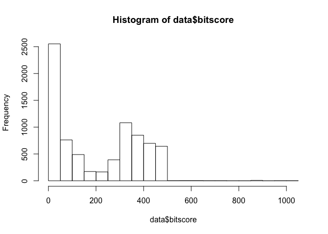
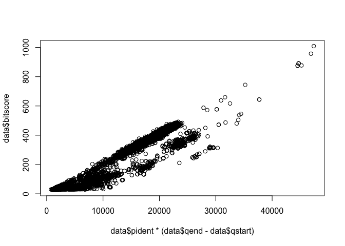
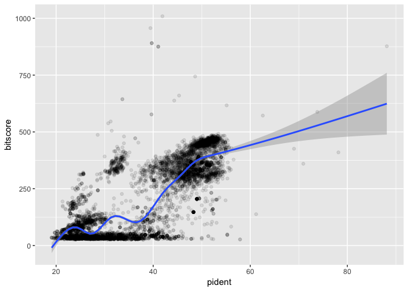
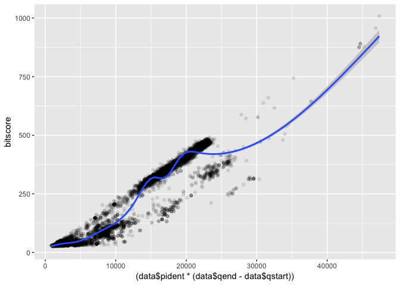
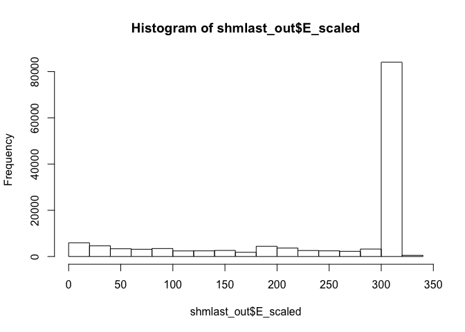
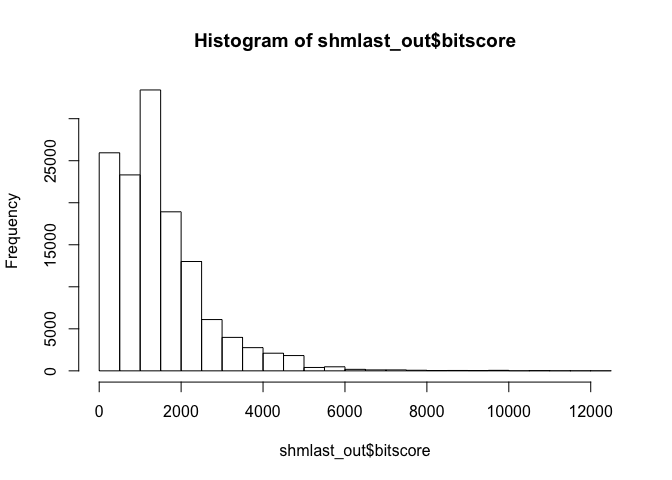
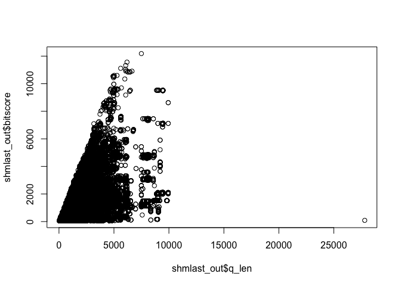

16: Essential UNIX for bioinformatics
================
Xuerui Huang
6/6/2019

``` r
library(dplyr)
library(ggplot2)
```

# Using RStudio online (or locally) to read your output

## Section I

``` r
#load file
data <- read.table("mm-second.x.zebrafish.tsv") 
colnames(data) <- c("qseqid", "sseqid", "pident", "length", "mismatch", "gapopen", "qstart", "qend", "sstart", "send", "evalue", "bitscore")

#plot histogram of bitscore
hist(data$bitscore,breaks = 30)
```

<!-- -->

``` r
## Asuming your blast results are stored in an object called 'b'
plot(data$pident  * (data$qend - data$qstart), data$bitscore)
```

<!-- -->

``` r
#using ggplot 
ggplot(data,aes(pident, bitscore)) + geom_point(alpha=0.1) +geom_smooth() 
```

    ## `geom_smooth()` using method = 'gam' and formula 'y ~ s(x, bs = "cs")'

<!-- -->

``` r
ggplot(data, aes((data$pident * (data$qend - data$qstart)), bitscore)) + geom_point(alpha=0.1) + geom_smooth()
```

    ## `geom_smooth()` using method = 'gam' and formula 'y ~ s(x, bs = "cs")'

<!-- -->

## Section III

``` r
#download data
download.file("https://bioboot.github.io/bggn213_S18/class-material/mouse.1.rna.fna.gz.x.cow.faa.crbl.csv.gz", "shmlast.csv")
shmlast_out <- read.csv("shmlast.csv")
head(shmlast_out)
```

    ##          E      EG2  E_scaled     ID bitscore q_aln_len q_frame q_len
    ## 1  6.6e-24  9.8e-16  23.18046 641897 109.6580        89       1   390
    ## 2 5.4e-194 4.4e-165 193.26761 719314 605.7589       313       0   331
    ## 3 2.8e-188 5.0e-160 187.55284 423289 588.9869       307       0   323
    ## 4 6.6e-183 5.6e-155 182.18046 725159 572.2148       307       0   318
    ## 5 5.4e-194 4.4e-165 193.26761 719315 605.7589       313       0   331
    ## 6 2.8e-188 5.0e-160 187.55284 423290 588.9869       307       0   323
    ##                                                                     q_name
    ## 1 ref|NM_001013372.2| Mus musculus neural regeneration protein (Nrp), mRNA
    ## 2     ref|NM_207235.1| Mus musculus olfactory receptor 358 (Olfr358), mRNA
    ## 3     ref|NM_146368.1| Mus musculus olfactory receptor 361 (Olfr361), mRNA
    ## 4     ref|NM_146622.1| Mus musculus olfactory receptor 360 (Olfr360), mRNA
    ## 5     ref|NM_207235.1| Mus musculus olfactory receptor 358 (Olfr358), mRNA
    ## 6     ref|NM_146368.1| Mus musculus olfactory receptor 361 (Olfr361), mRNA
    ##   q_start q_strand s_aln_len s_len
    ## 1      64        +        89   389
    ## 2       0        +       313   313
    ## 3       0        +       307   313
    ## 4       0        +       307   313
    ## 5       0        +       313   313
    ## 6       0        +       307   313
    ##                                                                                    s_name
    ## 1 ref|XP_005212262.1| PREDICTED: DNA oxidative demethylase ALKBH1 isoform X1 [Bos taurus]
    ## 2                        ref|XP_607965.3| PREDICTED: olfactory receptor 1361 [Bos taurus]
    ## 3                        ref|XP_607965.3| PREDICTED: olfactory receptor 1361 [Bos taurus]
    ## 4                        ref|XP_607965.3| PREDICTED: olfactory receptor 1361 [Bos taurus]
    ## 5                     ref|XP_002691614.1| PREDICTED: olfactory receptor 1361 [Bos taurus]
    ## 6                     ref|XP_002691614.1| PREDICTED: olfactory receptor 1361 [Bos taurus]
    ##   s_start s_strand score
    ## 1       0        +   241
    ## 2       0        +  1365
    ## 3       0        +  1327
    ## 4       0        +  1289
    ## 5       0        +  1365
    ## 6       0        +  1327

``` r
# Check dimention of data
dim(shmlast_out)
```

    ## [1] 132900     17

### Visualization of data

look at the E\_scaled column:

``` r
hist(shmlast_out$E_scaled)
```

<!-- -->

We could see that most of the values in the E\_scaled column are quite
high.

look at the bitscore column

``` r
hist(shmlast_out$bitscore) 
```

<!-- -->

Compare E\_scaled to the bitscores

``` r
plot(shmlast_out$q_len, shmlast_out$bitscore)
```

<!-- -->
