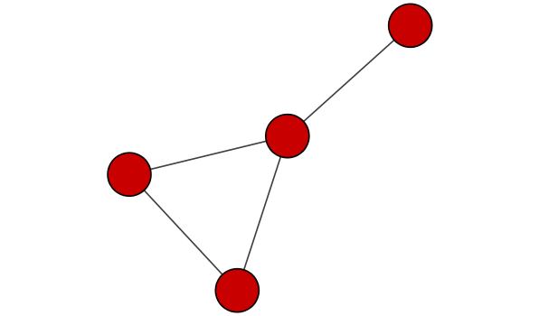
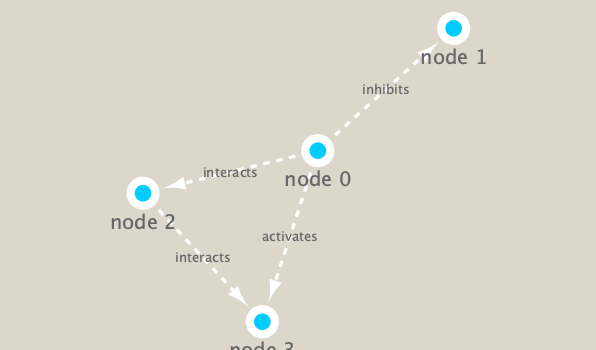

```{r setup, include=FALSE}
knitr::opts_chunk$set(echo = TRUE)
```

# load package
```{r,echo=FALSE,message=FALSE}
library(RCy3)
library(igraph)
library(RColorBrewer)
```

test the package 
```{r}
# test whetehr the package is running correctly
cytoscapePing()
cytoscapeVersionInfo()

# loading the defualt graph in the package
g <- makeSimpleIgraph()
createNetworkFromIgraph(g,"myGraph")
plot(g)

fig <- exportImage(filename="demo", type="png", height=350)

```
switch styles
```{r}
setVisualStyle("Marquee")
fig <- exportImage(filename="demo_marquee", type="png", height=350)



styles <- getVisualStyleNames()
styles
```

# plot data
```{r}
## scripts for processing located in "inst/data-raw/"
prok_vir_cor <- read.delim("virus_prok_cor_abundant.tsv", stringsAsFactors = FALSE)

## Have a peak at the first 6 rows
head(prok_vir_cor)
```
how many unique species are there 
```{r}
length(unique(prok_vir_cor[,1],prok_vir_cor[,2]))
```

plot
```{r}
g <- graph.data.frame(prok_vir_cor, directed = FALSE)
class(g)
g
```
```{r}
plot(g, vertex.size=3, vertex.label=NA)
```

# ggplot 
```{r}
library(ggraph)
ggraph(g, layout = 'auto') +
  geom_edge_link(alpha = 0.25) +
  geom_node_point(color="steelblue") +
  theme_graph()
```
# calculation

## Basic info
```{r}
V(g) # query vertex
E(g) # query edges
```
## network community detection]
```{r}
cb <- cluster_edge_betweenness(g)
cb
plot(cb, y=g, vertex.label=NA,  vertex.size=3)
head( membership(cb) )
```
```{r}
# Calculate and plot node degree of our network
d <- degree(g)
hist(d, breaks=30, col="lightblue", main ="Node Degree Distribution")
plot( degree_distribution(g), type="h" )

plot(degree_distribution(g),type = "p",log = "xy",main="Log Node Degree Distribution")
```
## Centrality analysis
```{r}
pr <- page_rank(g)
head(pr$vector)

v.size <- BBmisc::normalize(pr$vector, range=c(2,20), method="range")
plot(g, vertex.size=v.size, vertex.label=NA)
```

# taxonomic classification
```{r}
phage_id_affiliation <- read.delim("phage_ids_with_affiliation.tsv")
head(phage_id_affiliation)

bac_id_affi <- read.delim("prok_tax_from_silva.tsv", stringsAsFactors = FALSE)
head(bac_id_affi)

```

