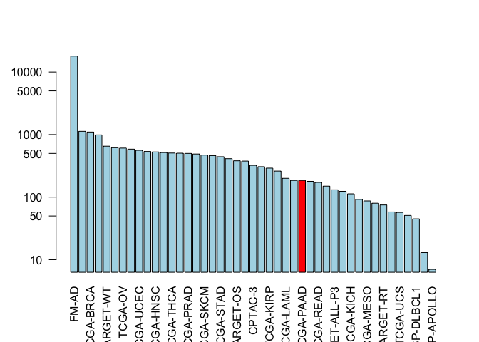

Class17 R anlysis
================
Xuerui HUang
5/31/2019

``` r
library(GenomicDataCommons)
```

    ## Loading required package: magrittr

    ## 
    ## Attaching package: 'GenomicDataCommons'

    ## The following object is masked from 'package:stats':
    ## 
    ##     filter

``` r
library(TCGAbiolinks)
```

    ## Registered S3 methods overwritten by 'ggplot2':
    ##   method         from 
    ##   [.quosures     rlang
    ##   c.quosures     rlang
    ##   print.quosures rlang

    ## Registered S3 method overwritten by 'R.oo':
    ##   method        from       
    ##   throw.default R.methodsS3

``` r
library(maftools)

status()
```

    ## $commit
    ## [1] "e588f035feefee17f562b3a1bc2816c49a2b2b19"
    ## 
    ## $data_release
    ## [1] "Data Release 16.0 - March 26, 2019"
    ## 
    ## $status
    ## [1] "OK"
    ## 
    ## $tag
    ## [1] "1.20.0"
    ## 
    ## $version
    ## [1] 1

``` r
projects <- getGDCprojects()
head(projects)
```

    ##   dbgap_accession_number
    ## 1                   <NA>
    ## 2              phs000466
    ## 3                   <NA>
    ## 4                   <NA>
    ## 5              phs001444
    ## 6              phs000471
    ##                                                          disease_type
    ## 1 Cystic, Mucinous and Serous Neoplasms, Adenomas and Adenocarcinomas
    ## 2                                    Clear Cell Sarcoma of the Kidney
    ## 3                                               Mesothelial Neoplasms
    ## 4                                        Adenomas and Adenocarcinomas
    ## 5                     Lymphoid Neoplasm Diffuse Large B-cell Lymphoma
    ## 6                                               High-Risk Wilms Tumor
    ##   releasable released state
    ## 1      FALSE     TRUE  open
    ## 2      FALSE     TRUE  open
    ## 3      FALSE     TRUE  open
    ## 4      FALSE     TRUE  open
    ## 5      FALSE     TRUE  open
    ## 6      FALSE     TRUE  open
    ##                                                                                     primary_site
    ## 1 Rectosigmoid junction, Unknown, Rectum, Colon, Connective, subcutaneous and other soft tissues
    ## 2                                                                                         Kidney
    ## 3                                              Heart, mediastinum, and pleura, Bronchus and lung
    ## 4   Other and unspecified parts of biliary tract, Gallbladder, Liver and intrahepatic bile ducts
    ## 5                                                                                    Lymph Nodes
    ## 6                                                                                         Kidney
    ##     project_id           id
    ## 1    TCGA-READ    TCGA-READ
    ## 2  TARGET-CCSK  TARGET-CCSK
    ## 3    TCGA-MESO    TCGA-MESO
    ## 4    TCGA-CHOL    TCGA-CHOL
    ## 5 NCICCR-DLBCL NCICCR-DLBCL
    ## 6    TARGET-WT    TARGET-WT
    ##                                                  name tumor
    ## 1                               Rectum Adenocarcinoma  READ
    ## 2                    Clear Cell Sarcoma of the Kidney  CCSK
    ## 3                                        Mesothelioma  MESO
    ## 4                                  Cholangiocarcinoma  CHOL
    ## 5 Genomic Variation in Diffuse Large B Cell Lymphomas DLBCL
    ## 6                               High-Risk Wilms Tumor    WT

``` r
cases_by_project <- cases() %>% facet("project.project_id") %>% aggregations()
head(cases_by_project)
```

    ## $project.project_id
    ##               key doc_count
    ## 1           FM-AD     18004
    ## 2      TARGET-NBL      1127
    ## 3       TCGA-BRCA      1098
    ## 4      TARGET-AML       988
    ## 5       TARGET-WT       652
    ## 6        TCGA-GBM       617
    ## 7         TCGA-OV       608
    ## 8       TCGA-LUAD       585
    ## 9       TCGA-UCEC       560
    ## 10      TCGA-KIRC       537
    ## 11      TCGA-HNSC       528
    ## 12       TCGA-LGG       516
    ## 13      TCGA-THCA       507
    ## 14      TCGA-LUSC       504
    ## 15      TCGA-PRAD       500
    ## 16   NCICCR-DLBCL       489
    ## 17      TCGA-SKCM       470
    ## 18      TCGA-COAD       461
    ## 19      TCGA-STAD       443
    ## 20      TCGA-BLCA       412
    ## 21      TARGET-OS       381
    ## 22      TCGA-LIHC       377
    ## 23        CPTAC-3       322
    ## 24      TCGA-CESC       307
    ## 25      TCGA-KIRP       291
    ## 26      TCGA-SARC       261
    ## 27      TCGA-LAML       200
    ## 28      TCGA-ESCA       185
    ## 29      TCGA-PAAD       185
    ## 30      TCGA-PCPG       179
    ## 31      TCGA-READ       172
    ## 32      TCGA-TGCT       150
    ## 33  TARGET-ALL-P3       131
    ## 34      TCGA-THYM       124
    ## 35      TCGA-KICH       113
    ## 36       TCGA-ACC        92
    ## 37      TCGA-MESO        87
    ## 38       TCGA-UVM        80
    ## 39      TARGET-RT        75
    ## 40      TCGA-DLBC        58
    ## 41       TCGA-UCS        57
    ## 42      TCGA-CHOL        51
    ## 43    CTSP-DLBCL1        45
    ## 44    TARGET-CCSK        13
    ## 45 VAREPOP-APOLLO         7

``` r
# plot barplot
x <- cases_by_project$project.project_id
colvec <- rep("lightblue", nrow(x))
colvec[which(x$key=="TCGA-PAAD")] <- "red"

barplot(x$doc_count,log="y",names.arg=x$key,col=colvec, las=2)
```

<!-- -->

# Detect Cancer

``` r
library(bio3d)
seqs<- read.fasta("lecture18_sequences.fa")

kmer_cands <- c()
for (i in (1:length(seqs$ali))){
  if (seqs$ali[,i][2] == "-"){
    break
  }
  if (seqs$ali[,i][1]!=seqs$ali[,i][2]){
    for (j in ((i-8):i)){
      temp_kmer <- seqs$ali[,c(j:(j+8))] %>% as.data.frame(.) %>% .[2,] %>% unlist(.) %>% as.character(.)
      temp_kmer <- paste(temp_kmer, collapse = '')
      kmer_cands <- c(kmer_cands,temp_kmer)
    }
  }
  
}

kmer_cands
```

    ##  [1] "SPLPSQAML" "PLPSQAMLD" "LPSQAMLDL" "PSQAMLDLM" "SQAMLDLML"
    ##  [6] "QAMLDLMLS" "AMLDLMLSP" "MLDLMLSPD" "LDLMLSPDD" "DPGPDEAPW"
    ## [11] "PGPDEAPWM" "GPDEAPWMP" "PDEAPWMPE" "DEAPWMPEA" "EAPWMPEAA"
    ## [16] "APWMPEAAP" "PWMPEAAPP" "WMPEAAPPV" "YLDDRNTFV" "LDDRNTFVH"
    ## [21] "DDRNTFVHS" "DRNTFVHSV" "RNTFVHSVV" "NTFVHSVVV" "TFVHSVVVP"
    ## [26] "FVHSVVVPY" "VHSVVVPYE" "ILTIITLEV" "LTIITLEV-" "TIITLEV--"
    ## [31] "IITLEV---" "ITLEV----" "TLEV-----" "LEV------" "EV-------"
    ## [36] "V--------"

``` r
conserv(seqs,method = "identity")
```

    ##   [1] 1.0 1.0 1.0 1.0 1.0 1.0 1.0 1.0 1.0 1.0 1.0 1.0 1.0 1.0 1.0 1.0 1.0
    ##  [18] 1.0 1.0 1.0 1.0 1.0 1.0 1.0 1.0 1.0 1.0 1.0 1.0 1.0 1.0 1.0 1.0 1.0
    ##  [35] 1.0 1.0 1.0 1.0 1.0 1.0 0.5 1.0 1.0 1.0 1.0 1.0 1.0 1.0 1.0 1.0 1.0
    ##  [52] 1.0 1.0 1.0 1.0 1.0 1.0 1.0 1.0 1.0 1.0 1.0 1.0 1.0 0.5 1.0 1.0 1.0
    ##  [69] 1.0 1.0 1.0 1.0 1.0 1.0 1.0 1.0 1.0 1.0 1.0 1.0 1.0 1.0 1.0 1.0 1.0
    ##  [86] 1.0 1.0 1.0 1.0 1.0 1.0 1.0 1.0 1.0 1.0 1.0 1.0 1.0 1.0 1.0 1.0 1.0
    ## [103] 1.0 1.0 1.0 1.0 1.0 1.0 1.0 1.0 1.0 1.0 1.0 1.0 1.0 1.0 1.0 1.0 1.0
    ## [120] 1.0 1.0 1.0 1.0 1.0 1.0 1.0 1.0 1.0 1.0 1.0 1.0 1.0 1.0 1.0 1.0 1.0
    ## [137] 1.0 1.0 1.0 1.0 1.0 1.0 1.0 1.0 1.0 1.0 1.0 1.0 1.0 1.0 1.0 1.0 1.0
    ## [154] 1.0 1.0 1.0 1.0 1.0 1.0 1.0 1.0 1.0 1.0 1.0 1.0 1.0 1.0 1.0 1.0 1.0
    ## [171] 1.0 1.0 1.0 1.0 1.0 1.0 1.0 1.0 1.0 1.0 1.0 1.0 1.0 1.0 1.0 1.0 1.0
    ## [188] 1.0 1.0 1.0 1.0 1.0 1.0 1.0 1.0 1.0 1.0 1.0 1.0 1.0 1.0 1.0 1.0 1.0
    ## [205] 1.0 1.0 1.0 1.0 1.0 1.0 1.0 1.0 0.5 1.0 1.0 1.0 1.0 1.0 1.0 1.0 1.0
    ## [222] 1.0 1.0 1.0 1.0 1.0 1.0 1.0 1.0 1.0 1.0 1.0 1.0 1.0 1.0 1.0 1.0 1.0
    ## [239] 1.0 1.0 1.0 1.0 1.0 1.0 1.0 1.0 1.0 1.0 1.0 1.0 1.0 1.0 1.0 1.0 1.0
    ## [256] 1.0 1.0 1.0 0.5 0.5 0.5 0.5 0.5 0.5 0.5 0.5 0.5 0.5 0.5 0.5 0.5 0.5
    ## [273] 0.5 0.5 0.5 0.5 0.5 0.5 0.5 0.5 0.5 0.5 0.5 0.5 0.5 0.5 0.5 0.5 0.5
    ## [290] 0.5 0.5 0.5 0.5 0.5 0.5 0.5 0.5 0.5 0.5 0.5 0.5 0.5 0.5 0.5 0.5 0.5
    ## [307] 0.5 0.5 0.5 0.5 0.5 0.5 0.5 0.5 0.5 0.5 0.5 0.5 0.5 0.5 0.5 0.5 0.5
    ## [324] 0.5 0.5 0.5 0.5 0.5 0.5 0.5 0.5 0.5 0.5 0.5 0.5 0.5 0.5 0.5 0.5 0.5
    ## [341] 0.5 0.5 0.5 0.5 0.5 0.5 0.5 0.5 0.5 0.5 0.5 0.5 0.5 0.5 0.5 0.5 0.5
    ## [358] 0.5 0.5 0.5 0.5 0.5 0.5 0.5 0.5 0.5 0.5 0.5 0.5 0.5 0.5 0.5 0.5 0.5
    ## [375] 0.5 0.5 0.5 0.5 0.5 0.5 0.5 0.5 0.5 0.5 0.5 0.5 0.5 0.5 0.5 0.5 0.5
    ## [392] 0.5 0.5

Find the position in mismatch.inds that are NOt in gap.inds

``` r
## Calculate positional identity scores
ide <- conserv(seqs$ali, method="identity")
mismatch.inds <- which(ide < 1) 

gaps <- gap.inspect(seqs)
gap.inds <- gaps$t.inds

tumor.sites <- mismatch.inds[!mismatch.inds %in% gap.inds]
```

name the mismatch site

``` r
## Make a "names" label for our output sequences (one per mutant)
tumor.names <- paste0(seqs$ali["P53_wt",tumor.sites],
                       tumor.sites,
                       seqs$ali["P53_mutant",tumor.sites])

tumor.names
```

    ## [1] "D41L"  "R65W"  "R213V" "D259V"

``` r
## Sequence positions surounding each mutant site
start.position <- tumor.sites - 8
end.position <-  tumor.sites + 8

# Blank matrix to store sub-sequences
store.seqs <- matrix("-", nrow=length(tumor.sites), ncol=17)
rownames(store.seqs) <- tumor.names

## Extract each sub-sequence
for(i in 1:length(tumor.sites)) {
  store.seqs[i,] <- seqs$ali["P53_mutant",start.position[i]:end.position[i]]
}

## First blank out the gap positions 
store.seqs[store.seqs == "-"] <- ""

store.seqs
```

    ##       [,1] [,2] [,3] [,4] [,5] [,6] [,7] [,8] [,9] [,10] [,11] [,12] [,13]
    ## D41L  "S"  "P"  "L"  "P"  "S"  "Q"  "A"  "M"  "L"  "D"   "L"   "M"   "L"  
    ## R65W  "D"  "P"  "G"  "P"  "D"  "E"  "A"  "P"  "W"  "M"   "P"   "E"   "A"  
    ## R213V "Y"  "L"  "D"  "D"  "R"  "N"  "T"  "F"  "V"  "H"   "S"   "V"   "V"  
    ## D259V "I"  "L"  "T"  "I"  "I"  "T"  "L"  "E"  "V"  ""    ""    ""    ""   
    ##       [,14] [,15] [,16] [,17]
    ## D41L  "S"   "P"   "D"   "D"  
    ## R65W  "A"   "P"   "P"   "V"  
    ## R213V "V"   "P"   "Y"   "E"  
    ## D259V ""    ""    ""    ""

``` r
## Output a FASTA file for further analysis
write.fasta(seqs=store.seqs, ids=tumor.names, file="subsequences.fa")
```
