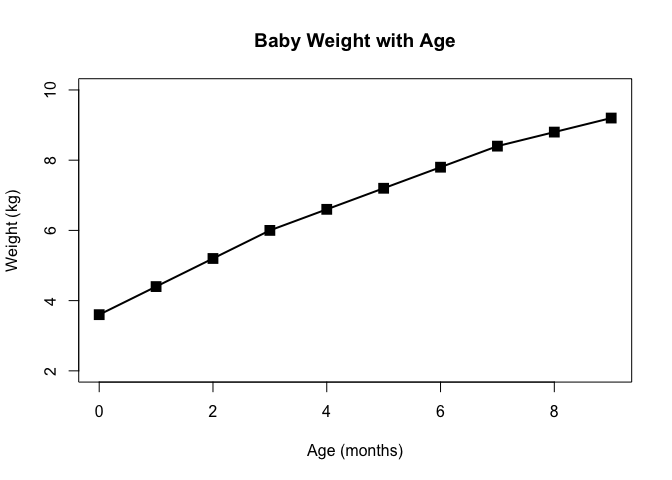
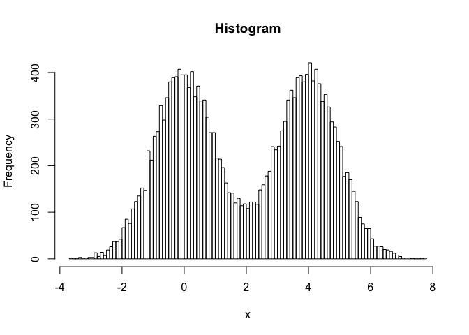

-   [load required libararies](#load-required-libararies)
-   [Section 2: Customizing plots](#section-2-customizing-plots)
    -   [2A. Line plot](#a.-line-plot)
    -   [2B. Barplot](#b.-barplot)
    -   [2C. Histograms](#c.-histograms)
-   [Section 3: Using color in plots](#section-3-using-color-in-plots)
    -   [3A. Providing color vectors](#a.-providing-color-vectors)
    -   [3B. Coloring by value](#b.-coloring-by-value)
    -   [3C. Dynamic use of color](#c.-dynamic-use-of-color)

load required libararies
========================

``` r
library(dplyr)
```

Section 2: Customizing plots
============================

2A. Line plot
-------------

The file weight\_chart.txt from the example data you downloaded above
contains data for a growth chart for a typical baby over the first 9
months of its life.

load data and plot line plot based on the info

``` r
#load data
weight <- read.table("./bimm143_05_rstats/weight_chart.txt",header=TRUE)

#doing plot 
plot(weight,pch=15,cex=1.5,lwd=2,ylim=c(2,10),xlab="Age (months)",
     ylab="Weight (kg)",main="Baby Weight with Age")
lines(weight,lwd=2)
```



2B. Barplot
-----------

The file feature\_counts.txt contains a summary of the number of
features of different types in the mouse GRCm38 genome.

load data and plot line barplot based on the info

``` r
# load data
feature <- read.csv("./bimm143_05_rstats/feature_counts.txt",sep = "\t") %>% 
  as.data.frame(.)

# check function documentation for further modification of plot
?barplot

#plot barplot
par(mar=c(5,10,4,2)+0.1,mgp=c(5,1,0)) #change margin
barplot(feature$Count,names.arg = feature$Feature,cex.names=0.8,
        xlab = "Count",las = 2,
        horiz=TRUE,las = 1,main="Num_Features_GRCm38")
```


2C. Histograms
--------------

Plot out the distribution of 10000 points sampled from a standard normal
distribution along with another 10000 points sampled from the same
distribution but with an offset of 4.

``` r
par(mar=c(5.1,4.1,4.1,2.1))
hist(c(rnorm(10000),rnorm(10000)+4),main = "Histogram",breaks=100,xlab = "x")
```



Section 3: Using color in plots
===============================

3A. Providing color vectors
---------------------------

The file male\_female\_counts.txt contains a time series split into male
and female count values.

Plot this as a barplot

``` r
# load data
mf_count <- read.csv("./bimm143_05_rstats/male_female_counts.txt",
                     sep = "\t",header = TRUE)

#plot
par(mar=c(8.1,4.1,4.1,2.1))
barplot(mf_count$Count,names.arg =mf_count$Sample,las = 2,
        col = rainbow(10))     
```


3B. Coloring by value
---------------------

The file up\_down\_expression.txt contains an expression comparison
dataset, but has an extra column which classifies the rows into one of 3
groups (up, down or unchanging).

Plot this as a scatterplot (plot) with the up being red, the down being
blue and the unchanging being grey.

``` r
#load data
expression <- read.csv("./bimm143_05_rstats/up_down_expression.txt",sep = "\t")

#data examination
dim(expression)
```

    ## [1] 5196    4

``` r
table(expression$State)
```

    ## 
    ##       down unchanging         up 
    ##         72       4997        127

``` r
#change palette manually
palette(c("red","gray","blue")) 
plot(expression$Condition1,expression$Condition2,col = expression$State,xlab="Expression condition 1", ylab="Expression condition 2")
```


3C. Dynamic use of color
------------------------

The file expression\_methylation.txt contains data for gene body
methylation, promoter methylation and gene expression.

``` r
# load data
meth <- read.csv("./bimm143_05_rstats/expression_methylation.txt",sep = "\t")

# data examination: number of genes in dataframe
nrow(meth)
```

    ## [1] 9241

``` r
# plot scatter plot
plot(meth$gene.meth, meth$expression)
```


Now try to color by density

``` r
# calculate density color 
dcols <- densCols(meth$gene.meth,meth$expression)
#plot
plot(meth$gene.meth,meth$expression,col = dcols,pch = 20)
```

 Since
most of the data is clustered near the origin. Tye to restrict to the
genes that have more than zero expresion values

``` r
# subset genes with above 0 expresion
meth.adj <- subset(meth,meth$expression>0)

#plot
dcols <- densCols(meth.adj$gene.meth,meth.adj$expression)
plot(meth.adj$gene.meth,meth.adj$expression,col = dcols,pch = 20)
```


``` r
# change color by using colorramp
dcols <- densCols(meth.adj$gene.meth,meth.adj$expression,
                  colramp=colorRampPalette(rainbow(4)))
plot(meth.adj$gene.meth,meth.adj$expression,col = dcols,pch = 20,
     xlab = "Expressopm",ylab = "Gene body methylation")
```


