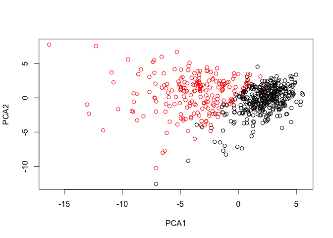
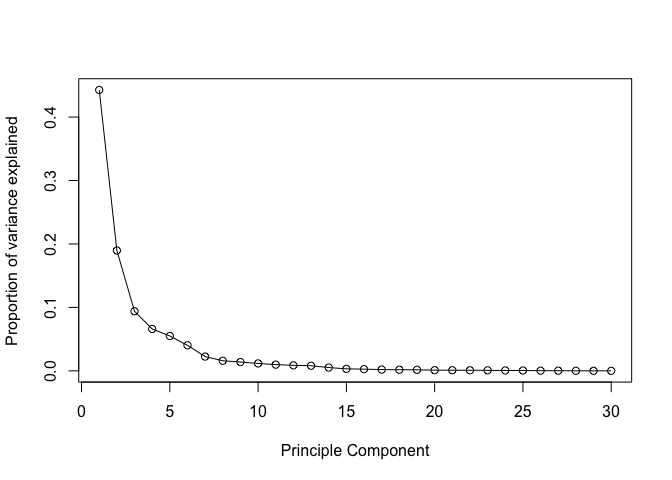
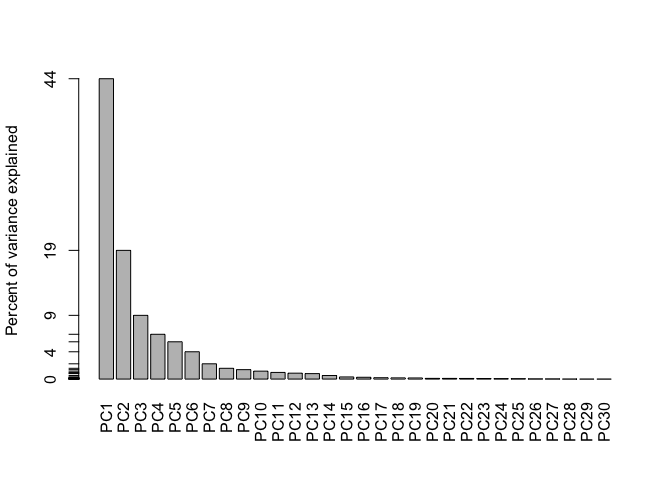
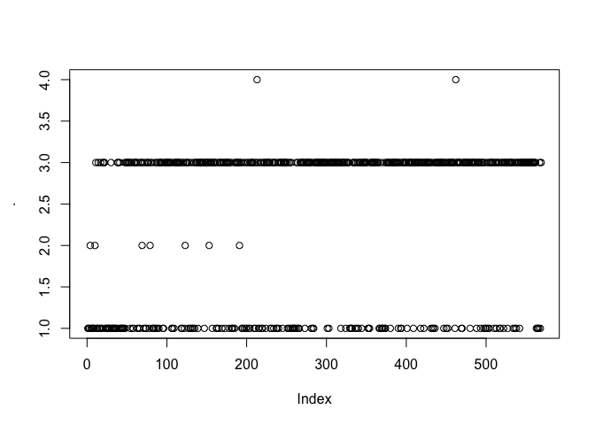

9: Unsupervised learning mini-project
================
Xuerui Huang
6/5/2019

``` r
library(dplyr)
```

# 1\. Exploratory data analysis

Data preparation

``` r
#load data from web
wisc.df <- read.csv("https://bioboot.github.io/bimm143_S18/class-material/WisconsinCancer.csv")
```

How many observations (i.e. patients) are in this dataset?
`nrow(wisc.df)`

How many of the observations have a malignant diagnosis?
`sum(wisc.df$diagnosis=="M")`

How many variables/features in the data are suffixed with \_mean?
`grepl("_mean", colnames(wisc.df)) %>% sum(.)`

Use as.matrix() to convert the other features (i.e. columns) of the data
(in columns 3 through 32) to a matrix. Store this in a variable called
wisc.data.

``` r
wisc.data <- as.matrix(wisc.df[,3:32])
row.names(wisc.data) <- wisc.df$id
head(wisc.data)
```

    ##          radius_mean texture_mean perimeter_mean area_mean smoothness_mean
    ## 842302         17.99        10.38         122.80    1001.0         0.11840
    ## 842517         20.57        17.77         132.90    1326.0         0.08474
    ## 84300903       19.69        21.25         130.00    1203.0         0.10960
    ## 84348301       11.42        20.38          77.58     386.1         0.14250
    ## 84358402       20.29        14.34         135.10    1297.0         0.10030
    ## 843786         12.45        15.70          82.57     477.1         0.12780
    ##          compactness_mean concavity_mean concave.points_mean symmetry_mean
    ## 842302            0.27760         0.3001             0.14710        0.2419
    ## 842517            0.07864         0.0869             0.07017        0.1812
    ## 84300903          0.15990         0.1974             0.12790        0.2069
    ## 84348301          0.28390         0.2414             0.10520        0.2597
    ## 84358402          0.13280         0.1980             0.10430        0.1809
    ## 843786            0.17000         0.1578             0.08089        0.2087
    ##          fractal_dimension_mean radius_se texture_se perimeter_se area_se
    ## 842302                  0.07871    1.0950     0.9053        8.589  153.40
    ## 842517                  0.05667    0.5435     0.7339        3.398   74.08
    ## 84300903                0.05999    0.7456     0.7869        4.585   94.03
    ## 84348301                0.09744    0.4956     1.1560        3.445   27.23
    ## 84358402                0.05883    0.7572     0.7813        5.438   94.44
    ## 843786                  0.07613    0.3345     0.8902        2.217   27.19
    ##          smoothness_se compactness_se concavity_se concave.points_se
    ## 842302        0.006399        0.04904      0.05373           0.01587
    ## 842517        0.005225        0.01308      0.01860           0.01340
    ## 84300903      0.006150        0.04006      0.03832           0.02058
    ## 84348301      0.009110        0.07458      0.05661           0.01867
    ## 84358402      0.011490        0.02461      0.05688           0.01885
    ## 843786        0.007510        0.03345      0.03672           0.01137
    ##          symmetry_se fractal_dimension_se radius_worst texture_worst
    ## 842302       0.03003             0.006193        25.38         17.33
    ## 842517       0.01389             0.003532        24.99         23.41
    ## 84300903     0.02250             0.004571        23.57         25.53
    ## 84348301     0.05963             0.009208        14.91         26.50
    ## 84358402     0.01756             0.005115        22.54         16.67
    ## 843786       0.02165             0.005082        15.47         23.75
    ##          perimeter_worst area_worst smoothness_worst compactness_worst
    ## 842302            184.60     2019.0           0.1622            0.6656
    ## 842517            158.80     1956.0           0.1238            0.1866
    ## 84300903          152.50     1709.0           0.1444            0.4245
    ## 84348301           98.87      567.7           0.2098            0.8663
    ## 84358402          152.20     1575.0           0.1374            0.2050
    ## 843786            103.40      741.6           0.1791            0.5249
    ##          concavity_worst concave.points_worst symmetry_worst
    ## 842302            0.7119               0.2654         0.4601
    ## 842517            0.2416               0.1860         0.2750
    ## 84300903          0.4504               0.2430         0.3613
    ## 84348301          0.6869               0.2575         0.6638
    ## 84358402          0.4000               0.1625         0.2364
    ## 843786            0.5355               0.1741         0.3985
    ##          fractal_dimension_worst
    ## 842302                   0.11890
    ## 842517                   0.08902
    ## 84300903                 0.08758
    ## 84348301                 0.17300
    ## 84358402                 0.07678
    ## 843786                   0.12440

# 2\. Principal Component Analysis

``` r
diagnosis <- wisc.df$diagnosis

apply(wisc.data,2,sd)#sd
```

    ##             radius_mean            texture_mean          perimeter_mean 
    ##            3.524049e+00            4.301036e+00            2.429898e+01 
    ##               area_mean         smoothness_mean        compactness_mean 
    ##            3.519141e+02            1.406413e-02            5.281276e-02 
    ##          concavity_mean     concave.points_mean           symmetry_mean 
    ##            7.971981e-02            3.880284e-02            2.741428e-02 
    ##  fractal_dimension_mean               radius_se              texture_se 
    ##            7.060363e-03            2.773127e-01            5.516484e-01 
    ##            perimeter_se                 area_se           smoothness_se 
    ##            2.021855e+00            4.549101e+01            3.002518e-03 
    ##          compactness_se            concavity_se       concave.points_se 
    ##            1.790818e-02            3.018606e-02            6.170285e-03 
    ##             symmetry_se    fractal_dimension_se            radius_worst 
    ##            8.266372e-03            2.646071e-03            4.833242e+00 
    ##           texture_worst         perimeter_worst              area_worst 
    ##            6.146258e+00            3.360254e+01            5.693570e+02 
    ##        smoothness_worst       compactness_worst         concavity_worst 
    ##            2.283243e-02            1.573365e-01            2.086243e-01 
    ##    concave.points_worst          symmetry_worst fractal_dimension_worst 
    ##            6.573234e-02            6.186747e-02            1.806127e-02

``` r
colMeans(wisc.data)#mean
```

    ##             radius_mean            texture_mean          perimeter_mean 
    ##            1.412729e+01            1.928965e+01            9.196903e+01 
    ##               area_mean         smoothness_mean        compactness_mean 
    ##            6.548891e+02            9.636028e-02            1.043410e-01 
    ##          concavity_mean     concave.points_mean           symmetry_mean 
    ##            8.879932e-02            4.891915e-02            1.811619e-01 
    ##  fractal_dimension_mean               radius_se              texture_se 
    ##            6.279761e-02            4.051721e-01            1.216853e+00 
    ##            perimeter_se                 area_se           smoothness_se 
    ##            2.866059e+00            4.033708e+01            7.040979e-03 
    ##          compactness_se            concavity_se       concave.points_se 
    ##            2.547814e-02            3.189372e-02            1.179614e-02 
    ##             symmetry_se    fractal_dimension_se            radius_worst 
    ##            2.054230e-02            3.794904e-03            1.626919e+01 
    ##           texture_worst         perimeter_worst              area_worst 
    ##            2.567722e+01            1.072612e+02            8.805831e+02 
    ##        smoothness_worst       compactness_worst         concavity_worst 
    ##            1.323686e-01            2.542650e-01            2.721885e-01 
    ##    concave.points_worst          symmetry_worst fractal_dimension_worst 
    ##            1.146062e-01            2.900756e-01            8.394582e-02

``` r
# scaling the data
wisc.pr <- prcomp(wisc.data,scale. = TRUE)
summary(wisc.pr)
```

    ## Importance of components:
    ##                           PC1    PC2     PC3     PC4     PC5     PC6
    ## Standard deviation     3.6444 2.3857 1.67867 1.40735 1.28403 1.09880
    ## Proportion of Variance 0.4427 0.1897 0.09393 0.06602 0.05496 0.04025
    ## Cumulative Proportion  0.4427 0.6324 0.72636 0.79239 0.84734 0.88759
    ##                            PC7     PC8    PC9    PC10   PC11    PC12
    ## Standard deviation     0.82172 0.69037 0.6457 0.59219 0.5421 0.51104
    ## Proportion of Variance 0.02251 0.01589 0.0139 0.01169 0.0098 0.00871
    ## Cumulative Proportion  0.91010 0.92598 0.9399 0.95157 0.9614 0.97007
    ##                           PC13    PC14    PC15    PC16    PC17    PC18
    ## Standard deviation     0.49128 0.39624 0.30681 0.28260 0.24372 0.22939
    ## Proportion of Variance 0.00805 0.00523 0.00314 0.00266 0.00198 0.00175
    ## Cumulative Proportion  0.97812 0.98335 0.98649 0.98915 0.99113 0.99288
    ##                           PC19    PC20   PC21    PC22    PC23   PC24
    ## Standard deviation     0.22244 0.17652 0.1731 0.16565 0.15602 0.1344
    ## Proportion of Variance 0.00165 0.00104 0.0010 0.00091 0.00081 0.0006
    ## Cumulative Proportion  0.99453 0.99557 0.9966 0.99749 0.99830 0.9989
    ##                           PC25    PC26    PC27    PC28    PC29    PC30
    ## Standard deviation     0.12442 0.09043 0.08307 0.03987 0.02736 0.01153
    ## Proportion of Variance 0.00052 0.00027 0.00023 0.00005 0.00002 0.00000
    ## Cumulative Proportion  0.99942 0.99969 0.99992 0.99997 1.00000 1.00000

# Interpreting PCA results

``` r
#plot biplot
biplot(wisc.pr)
```

<!-- -->

``` r
# Generate plot for principal components 1 and 2
plot(wisc.pr$x[,c(1)],wisc.pr$x[,2],col = diagnosis,
     xlab = "PCA1",ylab = "PCA2")
```

<!-- -->

``` r
# Generate a similar plot for principal components 1 and 3
plot(wisc.pr$x[,c(1)],wisc.pr$x[,3],col = diagnosis,
     xlab = "PCA1",ylab = "PCA3")
```

<!-- --> Principal
component 2 explains more variance in the original data than principal
component 3.

# Variance explained

Calculate the variance of each principal component by squaring the sdev
component of wisc.pr

``` r
# Variance calculation
pr.var <- wisc.pr$sdev^2
head(pr.var)
```

    ## [1] 13.281608  5.691355  2.817949  1.980640  1.648731  1.207357

``` r
pve <- pr.var/sum(pr.var)

#plot
plot(pve,type = "o",xlab = "Principle Component",
     ylab = "Proportion of variance explained")
```

<!-- -->

``` r
# Alternative plot in bar plot format
barplot(pve,names.arg = paste0("PC",c(1:length(pve))),las = 2,
        ylab = "Percent of variance explained",axes = FALSE)+
  axis(2, at=pve, labels=round(pve,2)*100 )
```

<!-- -->

    ##             [,1]
    ##  [1,]  0.7000044
    ##  [2,]  1.9000250
    ##  [3,]  3.1000530
    ##  [4,]  4.3002300
    ##  [5,]  5.5002726
    ##  [6,]  6.7005160
    ##  [7,]  7.9006018
    ##  [8,]  9.1008114
    ##  [9,] 10.3009146
    ## [10,] 11.5009991
    ## [11,] 12.7010386
    ## [12,] 13.9016493
    ## [13,] 15.1017540
    ## [14,] 16.3019800
    ## [15,] 17.5026621
    ## [16,] 18.7031378
    ## [17,] 19.9052337
    ## [18,] 21.1080452
    ## [19,] 22.3087054
    ## [20,] 23.5097972
    ## [21,] 24.7116898
    ## [22,] 25.9138965
    ## [23,] 27.1158872
    ## [24,] 28.3225073
    ## [25,] 29.5402452
    ## [26,] 30.7549577
    ## [27,] 31.9660213
    ## [28,] 33.1939316
    ## [29,] 34.4897118
    ## [30,] 35.9427203

Try to plot similar plot by using **factoextra** package

``` r
require(factoextra)
```

    ## Loading required package: factoextra

    ## Loading required package: ggplot2

    ## Registered S3 methods overwritten by 'ggplot2':
    ##   method         from 
    ##   [.quosures     rlang
    ##   c.quosures     rlang
    ##   print.quosures rlang

    ## Welcome! Related Books: `Practical Guide To Cluster Analysis in R` at https://goo.gl/13EFCZ

``` r
fviz_eig(wisc.pr, addlabels = TRUE)
```

<!-- -->

# 3\. Hierarchical clustering

``` r
#hierachical clustering
data.scaled <- scale(wisc.data)

# Calculate the (Euclidean) distances 
data.dist <- dist(data.scaled)

# Create a hierarchical clustering model using complete linkage
hclust(data.dist) %>% plot(.)+abline(h = 18,col = "red")
```

<!-- -->

    ## integer(0)

``` r
cutree(hclust(data.dist),k = 4)%>% plot(.)
```

<!-- -->

select number of clusters

``` r
wisc.hclust.clusters <- cutree(hclust(data.dist),k = 6)

# check the grouping of data based on K-means and compair with original data
table(wisc.hclust.clusters,diagnosis)
```

    ##                     diagnosis
    ## wisc.hclust.clusters   B   M
    ##                    1  12 165
    ##                    2   0   5
    ##                    3 331  39
    ##                    4   2   0
    ##                    5  12   1
    ##                    6   0   2
