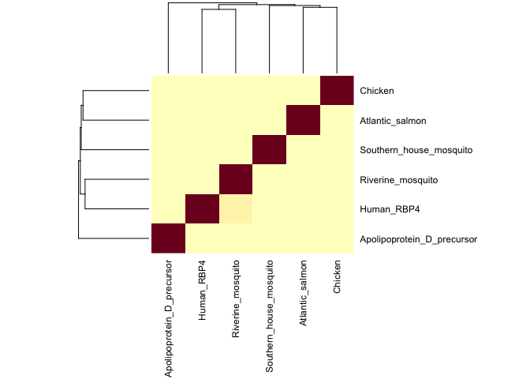
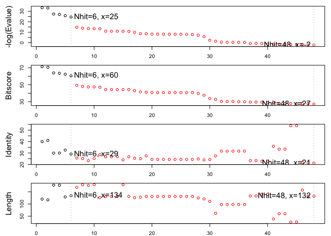

Final Project R Analysis
================
Xuerui HUang
6/2/2019
# Full Version Report
The [whole project](https://github.com/SherryH1229/BGGN213/blob/master/project/BGGN213_W19_x7huang.pdf) in PDF formt 
# Load package

``` r
library("bio3d")
```

# Calculation

Load fasta file

``` r
seqs<- read.fasta("Sequences.fa")

seqs
```

    ##                                1        .         .         .         .         50 
    ## [Truncated_Name:1]Human_RBP4   MKWVWALLLLAALGSGRAERDCRVSSFRVKENFDKARFSGTWYAMAKKDP
    ## [Truncated_Name:2]Apolipopro   YAGRWYEIKRYEQFYEKDLDCVVAEYQKTGDNSISVKNGAFSLANNTRVV
    ## [Truncated_Name:3]Riverine_m   MHSSLLAIVLLATVAATVTGLLTDSACPEGVKVKQNFSLKDYVGRWYEIK
    ## [Truncated_Name:4]Southern_h   MYKSPQVFAAALLVLGLSSAVVYGVIYDRPCRTEISVVQNFCLDRYLGKW
    ## [Truncated_Name:5]Atlantic_s   MQALHVLSLTLLSILTANAQTLRPGKCPQPPVQANFDAARYLGKWYEIKK
    ## [Truncated_Name:6]Chicken      MAYTWRALLLLALAFLGSSMAERDCRVSSFKVKENFDKNRYSGTWYAMAK
    ##                                                                                   
    ##                                1        .         .         .         .         50 
    ## 
    ##                               51        .         .         .         .         100 
    ## [Truncated_Name:1]Human_RBP4   EGLFLQDNIVAEFSVDETGQMSATAKGRVRLLNNWDVCADMVGTFTDTED
    ## [Truncated_Name:2]Apolipopro   ADGTAVVSYPDDTTHPAKLSVAFFGAKADRSNYWVLDTDYTSFAVVWSCE
    ## [Truncated_Name:3]Riverine_m   RYEQFYEKDLDCVVAEYQPREEGGITVANGAFSLANNTRVVGQGVGIISY
    ## [Truncated_Name:4]Southern_h   YELQRYEQPFQTKVDCTTANYGLLDSATVSVRNSAFSLINGTSSEAIGTA
    ## [Truncated_Name:5]Atlantic_s   LPVVFQKGECTTATYSLESPGVVGVLNRELLADNTVSVITGYAKAKDPSE
    ## [Truncated_Name:6]Chicken      KDPEGLFLQDNVVAQFTVDENGQMSATAKGRVRLFNNWDVCADMIGSFTD
    ##                                                                                   
    ##                               51        .         .         .         .         100 
    ## 
    ##                              101        .         .         .         .         150 
    ## [Truncated_Name:1]Human_RBP4   PAKFKMKYWGVASFLQKGNDDHWIVDTDYDTYAVQYSCRLLNLDGTCADS
    ## [Truncated_Name:2]Apolipopro   PFFRDPSKNVLGFWIFSRNPTFPTDEAVVKRVDEL---------------
    ## [Truncated_Name:3]Riverine_m   PEAKDGKLSVAFFGAKPDRSNYWVLDTDYTSYAVVFSCEPYYKDASKNVL
    ## [Truncated_Name:4]Southern_h   VLSFPEQEIVQAKLNVSFFGAPNDRSNYWVIDTDYENFAIVWSCEPLPQD
    ## [Truncated_Name:5]Atlantic_s   PAKLEVTFFEDSPPGNYWVLSTDYEGHSVVYSCTDILGTFHADFAWILSR
    ## [Truncated_Name:6]Chicken      TEDPAKFKMKYWGVASFLQKGNDDHWVVDTDYDTYALHYSCRELNEDGTC
    ##                                                                                   
    ##                              101        .         .         .         .         150 
    ## 
    ##                              151        .         .         .         .         200 
    ## [Truncated_Name:1]Human_RBP4   YSFVFSRDPNGLPPEAQKIVRQRQEELCLARQYRLIVHNGYCDGRSERNL
    ## [Truncated_Name:2]Apolipopro   --------------------------------------------------
    ## [Truncated_Name:3]Riverine_m   GFWIFSRQPTFPTDETTVKHVQELVKQYGDESKFEITNQSDERCPRSYV-
    ## [Truncated_Name:4]Southern_h   QSSEGFWFLSRERKFTDDKDANERAFGAIRKYIDQSEIRFTNQADERCPD
    ## [Truncated_Name:5]Atlantic_s   ESTLSEEKLEELYNVFTSNGIDIDGMTVTNQSQELCADMPLWA-------
    ## [Truncated_Name:6]Chicken      ADSYSFVFSRDPKGLPPEAQKIVRQRQIDLCLDRKYRVIVHNGFCS----
    ##                                                                                   
    ##                              151        .         .         .         .         200 
    ## 
    ##                              201 
    ## [Truncated_Name:1]Human_RBP4   L
    ## [Truncated_Name:2]Apolipopro   -
    ## [Truncated_Name:3]Riverine_m   -
    ## [Truncated_Name:4]Southern_h   F
    ## [Truncated_Name:5]Atlantic_s   -
    ## [Truncated_Name:6]Chicken      -
    ##                                  
    ##                              201 
    ## 
    ## Call:
    ##   read.fasta(file = "Sequences.fa")
    ## 
    ## Class:
    ##   fasta
    ## 
    ## Alignment dimensions:
    ##   6 sequence rows; 201 position columns (135 non-gap, 66 gap) 
    ## 
    ## + attr: id, ali, call

plot heatmap

``` r
#calculation identity
iden <- seqidentity(seqs, normalize=TRUE, similarity=FALSE, ncore=1, nseg.scale=1)

# plot heatmap
heatmap(iden,cexRow = 0.9,cexCol = 0.9,margins=c(10,8))
```

<!-- --> \# Findthe
most similar atomic resolution structures Generate the consensus
sequence from alignment

``` r
# run consensus function in Bio3D wth default cutoff of 0.6
# Get a consensus seq for all 7 seqs
concensus_seq <- consensus(seqs)
concensus_seq$seq #too many gaps
```

    ##   [1] "M" "-" "-" "-" "-" "-" "-" "-" "-" "-" "-" "-" "-" "-" "-" "-" "-"
    ##  [18] "-" "-" "-" "-" "-" "-" "-" "-" "-" "-" "-" "-" "-" "-" "-" "-" "-"
    ##  [35] "-" "-" "-" "-" "-" "-" "-" "-" "-" "-" "-" "-" "-" "-" "-" "-" "-"
    ##  [52] "-" "-" "-" "-" "-" "-" "-" "-" "-" "-" "-" "-" "-" "-" "-" "-" "-"
    ##  [69] "-" "-" "-" "-" "-" "-" "-" "-" "-" "-" "-" "-" "-" "-" "-" "-" "-"
    ##  [86] "-" "-" "-" "-" "-" "-" "-" "-" "-" "-" "-" "-" "-" "-" "-" "P" "-"
    ## [103] "-" "-" "-" "-" "-" "-" "-" "-" "-" "-" "-" "-" "-" "-" "-" "-" "-"
    ## [120] "-" "-" "-" "-" "-" "-" "-" "-" "-" "-" "-" "-" "-" "-" "-" "-" "-"
    ## [137] "-" "-" "-" "-" "-" "-" "-" "-" "-" "-" "-" "-" "-" "-" "-" "-" "-"
    ## [154] "-" "-" "-" "-" "-" "-" "-" "-" "-" "-" "-" "-" "-" "-" "-" "-" "-"
    ## [171] "-" "-" "-" "-" "-" "-" "-" "-" "-" "-" "-" "-" "-" "-" "-" "-" "-"
    ## [188] "-" "-" "-" "-" "-" "-" "-" "-" "-" "-" "-" "-" "-" "-"

``` r
# Runing blast (error)
#blast.pdb(concensus_seq, database = "pdb", time.out = NULL, chain.single=TRUE)
```

There are too many gaps in the consensus sequence, try the sequence with
highest identity to all the al

``` r
require(dplyr)
```

    ## Loading required package: dplyr

    ## 
    ## Attaching package: 'dplyr'

    ## The following objects are masked from 'package:stats':
    ## 
    ##     filter, lag

    ## The following objects are masked from 'package:base':
    ## 
    ##     intersect, setdiff, setequal, union

``` r
#get the most similar sequence
which(iden[2:ncol(iden),] == (max(iden[2:ncol(iden),1])))
```

    ## [1] 2

``` r
sim_seq <- seqs$ali["Southern_house_mosquito",]

# Running blast
blast_res <- blast.pdb(sim_seq, database = "pdb", time.out = NULL, chain.single=TRUE)
```

    ##  Searching ... please wait (updates every 5 seconds) RID = FHRC7NWY015 
    ##  .
    ##  Reporting 48 hits

``` r
plot.blast(blast_res) #plot the blast result 
```

    ##   * Possible cutoff values:    24 -3 
    ##             Yielding Nhits:    6 48 
    ## 
    ##   * Chosen cutoff value of:    24 
    ##             Yielding Nhits:    6

<!-- -->

``` r
#Annote the bast result with mor specific info
annotate_res <- pdb.annotate(blast_res$hit.tbl$pdb.id[1:5])[,c("experimentalTechnique","resolution","source","chainId")]
```

    ## Warning in pdb.annotate(blast_res$hit.tbl$pdb.id[1:5]): ids should be
    ## standard 4 character PDB-IDs: trying first 4 characters...

``` r
# filter and reformat output info
res_out <- blast_res$hit.tbl[,c("pdb.id","evalue","identity")] %>% .[1:5,]
res_out <- merge(res_out,annotate_res,by.x = "pdb.id",by.y = "row.names") %>% .[order(-.$identity),]
res_out$pdb.id <-gsub("_.*","",res_out$pdb.id)

write.csv(res_out,"res.out")
```
